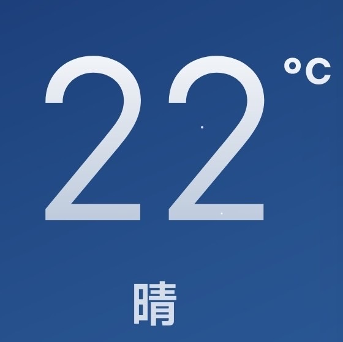
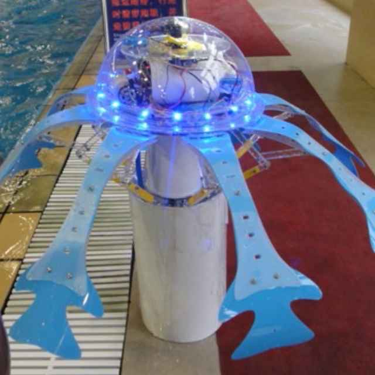
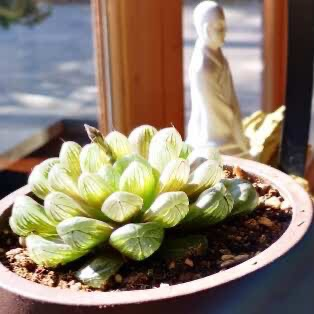
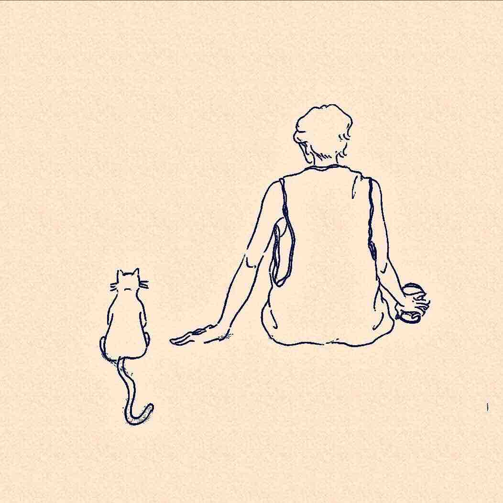
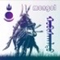
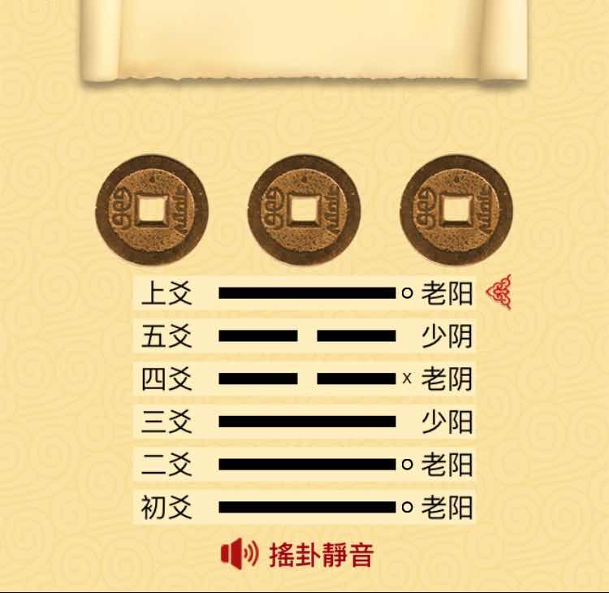
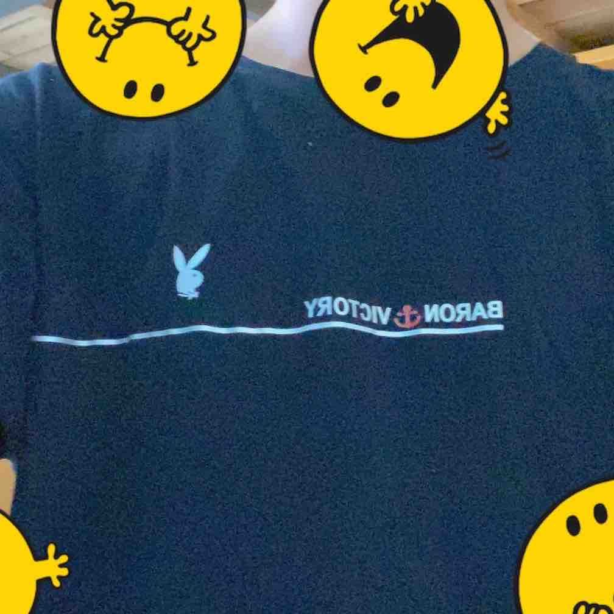
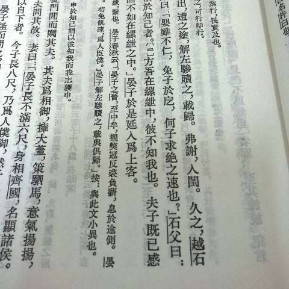
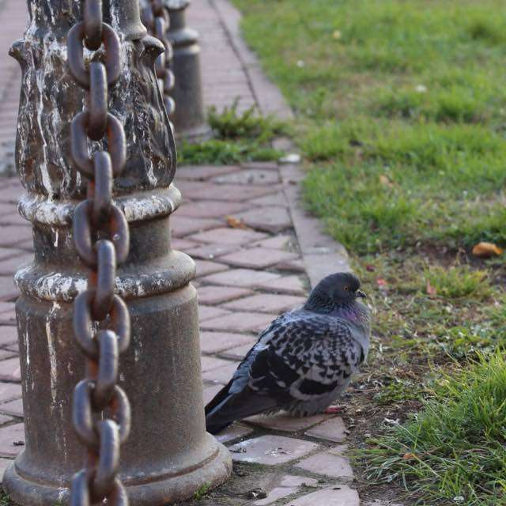

<h1 align="center">Simple mind map</h1>

[](https://www.npmjs.com/package/simple-mind-map)

[](https://github.com/wanglin2/mind-map/issues)

[](https://github.com/wanglin2/mind-map/stargazers)
[](https://github.com/wanglin2/mind-map/network/members)

> 中文名：思绪思维导图。一个简单&强大的 Web 思维导图库和思维导图软件。

本项目主要包含以下内容：

- 一个 `js` 思维导图库，不依赖任何框架，可以用来快速完成 Web 思维导图产品的开发。

>  开发文档：[https://wanglin2.github.io/mind-map-docs/](https://wanglin2.github.io/mind-map-docs/)

- 一个 Web 思维导图，基于思维导图库、`Vue2.x`、`ElementUI` 开发，支持操作电脑本地文件，可以当做一个在线版思维导图应用使用，也可以自部署和二次开发。

>  在线地址：[https://wanglin2.github.io/mind-map/](https://wanglin2.github.io/mind-map/)

- 客户端和插件

> 1.独立客户端，支持Windows、Mac及Linux系统。
>
> 下载地址：[Github](https://github.com/wanglin2/mind-map/releases)、[百度云盘](https://pan.baidu.com/s/1huasEbKsGNH2Af68dvWiOg?pwd=3bp3)

> 2.`uTools`插件，现已上架[uTools](https://www.u.tools/)插件应用市场。
>
> 可直接在`uTools`插件应用市场中搜索`思绪`进行安装，也可以直接访问该地址：[主页](https://www.u-tools.cn/plugins/detail/%E6%80%9D%E7%BB%AA%E6%80%9D%E7%BB%B4%E5%AF%BC%E5%9B%BE/)，点击右侧的【启动】按钮进行安装。

> 3.`obsidian`插件，首个版本现已发布：
>
> 下载地址：[https://github.com/wanglin2/obsidian-simplemindmap/releases](https://github.com/wanglin2/obsidian-simplemindmap/releases)

- 云存储版本，如果你需要带后端的云存储版本，可以尝试我们开发的另一个项目[理想文档](https://github.com/wanglin2/lx-doc)。

# 特性

- [x] 插件化架构，除核心功能外，其他功能作为插件提供，按需使用，减小打包体积
- [x] 支持逻辑结构图（向左、向右逻辑结构图）、思维导图、组织结构图、目录组织图、时间轴（横向、竖向）、鱼骨图等结构
- [x] 内置多种主题，允许高度自定义样式，支持注册新主题
- [x] 节点内容支持文本（普通文本、富文本）、图片、图标、超链接、备注、标签、概要、数学公式
- [x] 节点支持拖拽（拖拽移动、自由调整）、多种节点形状；支持扩展节点内容、支持使用 DDM 完全自定义节点内容
- [x] 支持画布拖动、缩放
- [x] 支持鼠标按键拖动选择和 Ctrl+左键两种多选节点方式
- [x] 支持导出为`json`、`png`、`svg`、`pdf`、`markdown`、`xmind`、`txt`，支持从`json`、`xmind`、`markdown`导入
- [x] 支持快捷键、前进后退、关联线、搜索替换、小地图、水印、滚动条、手绘风格、彩虹线条、标记、外框
- [x] 提供丰富的配置，满足各种场景各种使用习惯
- [x] 支持协同编辑
- [x] 支持演示模式
- [x] 更多功能等你来发现

官方提供了如下插件，可根据需求按需引入（某个功能不生效大概率是因为你没有引入对应的插件），具体使用方式请查看文档：

| RichText（节点富文本插件）           | Select（鼠标多选节点插件）                | Drag（节点拖拽插件）                 | AssociativeLine（关联线插件）        |
| ------------------------------------ | ----------------------------------------- | ------------------------------------ | ------------------------------------ |
| Export（导出插件）                   | KeyboardNavigation（键盘导航插件）        | MiniMap（小地图插件）                | Watermark（水印插件）                |
| TouchEvent（移动端触摸事件支持插件） | NodeImgAdjust（拖拽调整节点图片大小插件） | Search（搜索插件）                   | Painter（节点格式刷插件）            |
| Scrollbar（滚动条插件）              | Formula（数学公式插件）                   | Cooperate（协同编辑插件）            | RainbowLines（彩虹线条插件）         |
| Demonstrate（演示模式插件）          | OuterFrame（外框插件）                    | MindMapLayoutPro（思维导图布局插件） |                                      |


本项目不会实现的特性：

> 1.自由节点，即多个根节点；
>
> 2.概要节点后面继续添加节点；
>
> 如果你需要以上特性，那么本库可能无法满足你的需求。

# 安装

```bash
npm i simple-mind-map
```

# 使用

提供一个宽高不为 0 的容器元素：

```html
<div id="mindMapContainer"></div>
```

另外再设置一下`css`样式：

```css
#mindMapContainer * {
  margin: 0;
  padding: 0;
}
```

然后创建一个实例：

```js
import MindMap from "simple-mind-map";

const mindMap = new MindMap({
  el: document.getElementById("mindMapContainer"),
  data: {
    data: {
      text: "根节点",
    },
    children: [],
  },
});
```

即可得到一个思维导图。想要实现更多功能？可以查看[开发文档](https://wanglin2.github.io/mind-map-docs/)。

# License

[MIT](./LICENSE)。保留`simple-mind-map`版权声明和注明来源的情况下可随意商用，如有疑问或不想保留可联系作者通过付费的方式去除。

> 示例：可以在你应用中的关于页面、帮助页面、文档页面、开源声明等任何页面添加以下内容：
>
> 本产品思维导图基于SimpleMindMap项目开发，版权归源项目所有，[开源协议](https://github.com/wanglin2/mind-map/blob/main/LICENSE)。

# 微信交流群

微信添加`wanglinguanfang`拉你入群。根据过往的经验，大部分问题都可以通过查看issue列表或文档解决，所以提问前请确保你已经阅读完了所有文档，文档里没有的可在群里提问，不必私聊作者，如果你一定要私聊，请先赞助本项目（￥200+）。

<table>
    <tr>
        <td align="center" style="word-wrap: break-word; width: 75.0; height: 75.0">
            <a href="http://drawon.cn/">
                
                <br />
                <sub style="font-size:14px"><b>微信公众号</b></sub>
            </a>
        </td>
    </tr>
</table>

# star

如果喜欢本项目，欢迎点个 star，这对我们很重要。

[](https://star-history.com/#wanglin2/mind-map&Date)

# 关于定制

如果你有个性化的商用定制需求，可以联系我们，我们提供付费开发服务，无论前端、后端、还是部署，都可以帮你一站式搞定。

# 谁在使用

<table>
    <tr>
        <td align="center" style="word-wrap: break-word; width: 75.0; height: 75.0">
            <a href="http://drawon.cn/">
                
                <br />
                <sub style="font-size:14px"><b>drawon.cn(桌案)</b></sub>
            </a>
        </td>
    </tr>
</table>

# 请作者喝杯咖啡

开源不易，如果本项目有帮助到你的话，可以考虑请作者喝杯咖啡~你的赞助对项目的可持续发展非常重要，是作者持续维护的最大动力。

> 推荐使用支付宝，微信获取不到头像。转账请备注【思维导图赞助】。

> 赞助等级：最强王者（￥500+）、星耀赞助（￥300+）、钻石赞助（￥200+）、黄金赞助（￥100+）、青铜赞助

<p>
  
  
</p>

## 最强王者

<table>
    <tr>
        <td align="center" style="word-wrap: break-word; width: 75.0; height: 75.0">
            <a href="#">
                
                <br />
                <sub style="font-size:14px"><b>hi</b></sub>
            </a>
        </td>
    </tr>
</table>

## 钻石赞助

<table>
    <tr>
        <td align="center" style="word-wrap: break-word; width: 75.0; height: 75.0">
            <a href="#">
                
                <br />
                <sub style="font-size:14px"><b>黄智彪@一米一栗科技</b></sub>
            </a>
        </td>
        <td align="center" style="word-wrap: break-word; width: 75.0; height: 75.0">
            <a href="#">
                
                <br />
                <sub style="font-size:14px"><b>沨沄</b></sub>
            </a>
        </td>
        <td align="center" style="word-wrap: break-word; width: 75.0; height: 75.0">
            <a href="#">
                
                <br />
                <sub style="font-size:14px"><b>行</b></sub>
            </a>
        </td>
    </tr>
</table>

## 黄金赞助

<table>
    <tr>
        <td align="center" style="word-wrap: break-word; width: 75.0; height: 75.0">
            <a href="#">
                
                <br />
                <sub style="font-size:14px"><b>小土渣的宇宙</b></sub>
            </a>
        </td>
        <td align="center" style="word-wrap: break-word; width: 75.0; height: 75.0">
            <a href="#">
                
                <br />
                <sub style="font-size:14px"><b>Chris</b></sub>
            </a>
        </td>
        <td align="center" style="word-wrap: break-word; width: 75.0; height: 75.0">
            <a href="#">
                
                <br />
                <sub style="font-size:14px"><b>仓鼠</b></sub>
            </a>
        </td>
        <td align="center" style="word-wrap: break-word; width: 75.0; height: 75.0">
            <a href="#">
                
                <br />
                <sub style="font-size:14px"><b>风格</b></sub>
            </a>
        </td>
        <td align="center" style="word-wrap: break-word; width: 75.0; height: 75.0">
            <a href="#">
                
                <br />
                <sub style="font-size:14px"><b>LiuJL</b></sub>
            </a>
        </td>
        <td align="center" style="word-wrap: break-word; width: 75.0; height: 75.0">
            <a href="#">
                
                <br />
                <sub style="font-size:14px"><b>Kyle</b></sub>
            </a>
        </td>
        <td align="center" style="word-wrap: break-word; width: 75.0; height: 75.0">
            <a href="#">
                
                <br />
                <sub style="font-size:14px"><b>秀树因馨雨</b></sub>
            </a>
        </td>
        <td align="center" style="word-wrap: break-word; width: 75.0; height: 75.0">
            <a href="#">
                
                <br />
                <sub style="font-size:14px"><b>黄泳</b></sub>
            </a>
        </td>
        <td align="center" style="word-wrap: break-word; width: 75.0; height: 75.0">
            <a href="#">
                
                <br />
                <sub style="font-size:14px"><b>ccccs</b></sub>
            </a>
        </td>
        <td align="center" style="word-wrap: break-word; width: 75.0; height: 75.0">
            <a href="#">
                
                <br />
                <sub style="font-size:14px"><b>炫</b></sub>
            </a>
        </td>
    </tr>
    <tr>
        <td align="center" style="word-wrap: break-word; width: 75.0; height: 75.0">
            <a href="#">
                
                <br />
                <sub style="font-size:14px"><b>晏江</b></sub>
            </a>
        </td>
        <td align="center" style="word-wrap: break-word; width: 75.0; height: 75.0">
            <a href="#">
                
                <br />
                <sub style="font-size:14px"><b>梁辉</b></sub>
            </a>
        </td>
        <td align="center" style="word-wrap: break-word; width: 75.0; height: 75.0">
            <a href="#">
                
                <br />
                <sub style="font-size:14px"><b>千帆</b></sub>
            </a>
        </td>
        <td align="center" style="word-wrap: break-word; width: 75.0; height: 75.0">
            <a href="#">
                
                <br />
                <sub style="font-size:14px"><b>布林</b></sub>
            </a>
        </td>
        <td align="center" style="word-wrap: break-word; width: 75.0; height: 75.0">
            <a href="#">
                
                <br />
                <sub style="font-size:14px"><b>达仁科技</b></sub>
            </a>
        </td>
        <td align="center" style="word-wrap: break-word; width: 75.0; height: 75.0">
            <a href="#">
                
                <br />
                <sub style="font-size:14px"><b>沐风牧草</b></sub>
            </a>
        </td>
        <td align="center" style="word-wrap: break-word; width: 75.0; height: 75.0">
            <a href="#">
                
                <br />
                <sub style="font-size:14px"><b>俊奇</b></sub>
            </a>
        </td>
        <td align="center" style="word-wrap: break-word; width: 75.0; height: 75.0">
            <a href="#">
                
                <br />
                <sub style="font-size:14px"><b>庆国</b></sub>
            </a>
        </td>
        <td align="center" style="word-wrap: break-word; width: 75.0; height: 75.0">
            <a href="#">
                
                <br />
                <sub style="font-size:14px"><b>Matt</b></sub>
            </a>
        </td>
        <td align="center" style="word-wrap: break-word; width: 75.0; height: 75.0">
            <a href="#">
                
                <br />
                <sub style="font-size:14px"><b>雨馨</b></sub>
            </a>
        </td>
    </tr>
    <tr>
        <td align="center" style="word-wrap: break-word; width: 75.0; height: 75.0">
            <a href="#">
                
                <br />
                <sub style="font-size:14px"><b>峰</b></sub>
            </a>
        </td>
        <td align="center" style="word-wrap: break-word; width: 75.0; height: 75.0">
            <a href="#">
                
                <br />
                <sub style="font-size:14px"><b>御风</b></sub>
            </a>
        </td>
        <td align="center" style="word-wrap: break-word; width: 75.0; height: 75.0">
            <a href="#">
                
                <br />
                <sub style="font-size:14px"><b>兔子快跑</b></sub>
            </a>
        </td>
        <td align="center" style="word-wrap: break-word; width: 75.0; height: 75.0">
            <a href="#">
                
                <br />
                <sub style="font-size:14px"><b>LSHM</b></sub>
            </a>
        </td>
        <td align="center" style="word-wrap: break-word; width: 75.0; height: 75.0">
            <a href="#">
                
                <br />
                <sub style="font-size:14px"><b>newplayer</b></sub>
            </a>
        </td>
    </tr>
</table>

## 青铜赞助

<table>
    <tr>
        <td align="center" style="word-wrap: break-word; width: 75.0; height: 75.0">
            <a href="#">
                
                <br />
                <sub style="font-size:14px"><b>Think</b></sub>
            </a>
        </td>
        <td align="center" style="word-wrap: break-word; width: 75.0; height: 75.0">
            <a href="#">
                
                <br />
                <sub style="font-size:14px"><b>志斌</b></sub>
            </a>
        </td>
        <td align="center" style="word-wrap: break-word; width: 75.0; height: 75.0">
            <a href="#">
                
                <br />
                <sub style="font-size:14px"><b>qp</b></sub>
            </a>
        </td>
        <td align="center" style="word-wrap: break-word; width: 75.0; height: 75.0">
            <a href="#">
                
                <br />
                <sub style="font-size:14px"><b>ZXR</b></sub>
            </a>
        </td>
        <td align="center" style="word-wrap: break-word; width: 75.0; height: 75.0">
            <a href="#">
                
                <br />
                <sub style="font-size:14px"><b>花儿朵朵</b></sub>
            </a>
        </td>
        <td align="center" style="word-wrap: break-word; width: 75.0; height: 75.0">
            <a href="#">
                
                <br />
                <sub style="font-size:14px"><b>suka</b></sub>
            </a>
        </td>
        <td align="center" style="word-wrap: break-word; width: 75.0; height: 75.0">
            <a href="#">
                
                <br />
                <sub style="font-size:14px"><b>水车</b></sub>
            </a>
        </td>
        <td align="center" style="word-wrap: break-word; width: 75.0; height: 75.0">
            <a href="#">
                
                <br />
                <sub style="font-size:14px"><b>才镇</b></sub>
            </a>
        </td>
        <td align="center" style="word-wrap: break-word; width: 75.0; height: 75.0">
            <a href="#">
                
                <br />
                <sub style="font-size:14px"><b>小米bbᯤ²ᴳ</b></sub>
            </a>
        </td>
        <td align="center" style="word-wrap: break-word; width: 75.0; height: 75.0">
            <a href="#">
                
                <br />
                <sub style="font-size:14px"><b>*棐</b></sub>
            </a>
        </td>
    </tr>
    <tr>
        <td align="center" style="word-wrap: break-word; width: 75.0; height: 75.0">
            <a href="#">
                
                <br />
                <sub style="font-size:14px"><b>南风</b></sub>
            </a>
        </td>
        <td align="center" style="word-wrap: break-word; width: 75.0; height: 75.0">
            <a href="#">
                
                <br />
                <sub style="font-size:14px"><b>蜉蝣撼大叔</b></sub>
            </a>
        </td>
        <td align="center" style="word-wrap: break-word; width: 75.0; height: 75.0">
            <a href="#">
                
                <br />
                <sub style="font-size:14px"><b>乙</b></sub>
            </a>
        </td>
        <td align="center" style="word-wrap: break-word; width: 75.0; height: 75.0">
            <a href="#">
                
                <br />
                <sub style="font-size:14px"><b>敏</b></sub>
            </a>
        </td>
        <td align="center" style="word-wrap: break-word; width: 75.0; height: 75.0">
            <a href="#">
                
                <br />
                <sub style="font-size:14px"><b>有希</b></sub>
            </a>
        </td>
        <td align="center" style="word-wrap: break-word; width: 75.0; height: 75.0">
            <a href="#">
                
                <br />
                <sub style="font-size:14px"><b>樊笼</b></sub>
            </a>
        </td>
        <td align="center" style="word-wrap: break-word; width: 75.0; height: 75.0">
            <a href="#">
                
                <br />
                <sub style="font-size:14px"><b>小逗比</b></sub>
            </a>
        </td>
        <td align="center" style="word-wrap: break-word; width: 75.0; height: 75.0">
            <a href="#">
                
                <br />
                <sub style="font-size:14px"><b>天清如愿</b></sub>
            </a>
        </td>
        <td align="center" style="word-wrap: break-word; width: 75.0; height: 75.0">
            <a href="#">
                
                <br />
                <sub style="font-size:14px"><b>敬明朗</b></sub>
            </a>
        </td>
        <td align="center" style="word-wrap: break-word; width: 75.0; height: 75.0">
            <a href="#">
                
                <br />
                <sub style="font-size:14px"><b>飞箭</b></sub>
            </a>
        </td>
    </tr>
    <tr>
        <td align="center" style="word-wrap: break-word; width: 75.0; height: 75.0">
            <a href="#">
                
                <br />
                <sub style="font-size:14px"><b>戚永峰</b></sub>
            </a>
        </td>
        <td align="center" style="word-wrap: break-word; width: 75.0; height: 75.0">
            <a href="#">
                
                <br />
                <sub style="font-size:14px"><b>moom</b></sub>
            </a>
        </td>
        <td align="center" style="word-wrap: break-word; width: 75.0; height: 75.0">
            <a href="#">
                
                <br />
                <sub style="font-size:14px"><b>张扬</b></sub>
            </a>
        </td>
        <td align="center" style="word-wrap: break-word; width: 75.0; height: 75.0">
            <a href="#">
                
                <br />
                <sub style="font-size:14px"><b>长沙利奥软件</b></sub>
            </a>
        </td>
        <td align="center" style="word-wrap: break-word; width: 75.0; height: 75.0">
            <a href="#">
                
                <br />
                <sub style="font-size:14px"><b>HaHN</b></sub>
            </a>
        </td>
        <td align="center" style="word-wrap: break-word; width: 75.0; height: 75.0">
            <a href="#">
                
                <br />
                <sub style="font-size:14px"><b>继龙</b></sub>
            </a>
        </td>
        <td align="center" style="word-wrap: break-word; width: 75.0; height: 75.0">
            <a href="#">
                
                <br />
                <sub style="font-size:14px"><b>欣</b></sub>
            </a>
        </td>
        <td align="center" style="word-wrap: break-word; width: 75.0; height: 75.0">
            <a href="#">
                
                <br />
                <sub style="font-size:14px"><b>易空小易</b></sub>
            </a>
        </td>
        <td align="center" style="word-wrap: break-word; width: 75.0; height: 75.0">
            <a href="#">
                
                <br />
                <sub style="font-size:14px"><b>国发</b></sub>
            </a>
        </td>
        <td align="center" style="word-wrap: break-word; width: 75.0; height: 75.0">
            <a href="#">
                
                <br />
                <sub style="font-size:14px"><b>建明</b></sub>
            </a>
        </td>
    </tr>
    <tr>
        <td align="center" style="word-wrap: break-word; width: 75.0; height: 75.0">
            <a href="#">
                
                <br />
                <sub style="font-size:14px"><b>汪津合</b></sub>
            </a>
        </td>
        <td align="center" style="word-wrap: break-word; width: 75.0; height: 75.0">
            <a href="#">
                
                <br />
                <sub style="font-size:14px"><b>博文</b></sub>
            </a>
        </td>
        <td align="center" style="word-wrap: break-word; width: 75.0; height: 75.0">
            <a href="#">
                
                <br />
                <sub style="font-size:14px"><b>慕智打印-兰兰</b></sub>
            </a>
        </td>
        <td align="center" style="word-wrap: break-word; width: 75.0; height: 75.0">
            <a href="#">
                
                <br />
                <sub style="font-size:14px"><b>锦冰</b></sub>
            </a>
        </td>
        <td align="center" style="word-wrap: break-word; width: 75.0; height: 75.0">
            <a href="#">
                
                <br />
                <sub style="font-size:14px"><b>旭东</b></sub>
            </a>
        </td>
        <td align="center" style="word-wrap: break-word; width: 75.0; height: 75.0">
            <a href="#">
                
                <br />
                <sub style="font-size:14px"><b>橘半</b></sub>
            </a>
        </td>
        <td align="center" style="word-wrap: break-word; width: 75.0; height: 75.0">
            <a href="#">
                
                <br />
                <sub style="font-size:14px"><b>pluvet</b></sub>
            </a>
        </td>
        <td align="center" style="word-wrap: break-word; width: 75.0; height: 75.0">
            <a href="#">
                
                <br />
                <sub style="font-size:14px"><b>皇登攀</b></sub>
            </a>
        </td>
        <td align="center" style="word-wrap: break-word; width: 75.0; height: 75.0">
            <a href="#">
                
                <br />
                <sub style="font-size:14px"><b>SR</b></sub>
            </a>
        </td>
        <td align="center" style="word-wrap: break-word; width: 75.0; height: 75.0">
            <a href="#">
                
                <br />
                <sub style="font-size:14px"><b>逆水行舟</b></sub>
            </a>
        </td>
    </tr>
    <tr>
        <td align="center" style="word-wrap: break-word; width: 75.0; height: 75.0">
            <a href="#">
                
                <br />
                <sub style="font-size:14px"><b>L</b></sub>
            </a>
        </td>
        <td align="center" style="word-wrap: break-word; width: 75.0; height: 75.0">
            <a href="#">
                
                <br />
                <sub style="font-size:14px"><b>sunniberg</b></sub>
            </a>
        </td>
        <td align="center" style="word-wrap: break-word; width: 75.0; height: 75.0">
            <a href="#">
                
                <br />
                <sub style="font-size:14px"><b>sunniberg</b></sub>
            </a>
        </td>
        <td align="center" style="word-wrap: break-word; width: 75.0; height: 75.0">
            <a href="#">
                
                <br />
                <sub style="font-size:14px"><b>在下青铜五</b></sub>
            </a>
        </td>
        <td align="center" style="word-wrap: break-word; width: 75.0; height: 75.0">
            <a href="#">
                
                <br />
                <sub style="font-size:14px"><b>木星二号</b></sub>
            </a>
        </td>
        <td align="center" style="word-wrap: break-word; width: 75.0; height: 75.0">
            <a href="#">
                
                <br />
                <sub style="font-size:14px"><b>阿晨</b></sub>
            </a>
        </td>
        <td align="center" style="word-wrap: break-word; width: 75.0; height: 75.0">
            <a href="#">
                
                <br />
                <sub style="font-size:14px"><b>铁</b></sub>
            </a>
        </td>
        <td align="center" style="word-wrap: break-word; width: 75.0; height: 75.0">
            <a href="#">
                
                <br />
                <sub style="font-size:14px"><b>Alex</b></sub>
            </a>
        </td>
        <td align="center" style="word-wrap: break-word; width: 75.0; height: 75.0">
            <a href="#">
                
                <br />
                <sub style="font-size:14px"><b>子豪</b></sub>
            </a>
        </td>
        <td align="center" style="word-wrap: break-word; width: 75.0; height: 75.0">
            <a href="#">
                
                <br />
                <sub style="font-size:14px"><b>宏涛</b></sub>
            </a>
        </td>
    </tr>
    <tr>
        <td align="center" style="word-wrap: break-word; width: 75.0; height: 75.0">
            <a href="#">
                
                <br />
                <sub style="font-size:14px"><b>最多5个字</b></sub>
            </a>
        </td>
        <td align="center" style="word-wrap: break-word; width: 75.0; height: 75.0">
            <a href="#">
                
                <br />
                <sub style="font-size:14px"><b>ZX</b></sub>
            </a>
        </td>
        <td align="center" style="word-wrap: break-word; width: 75.0; height: 75.0">
            <a href="#">
                
                <br />
                <sub style="font-size:14px"><b>协成</b></sub>
            </a>
        </td>
        <td align="center" style="word-wrap: break-word; width: 75.0; height: 75.0">
            <a href="#">
                
                <br />
                <sub style="font-size:14px"><b>木木</b></sub>
            </a>
        </td>
        <td align="center" style="word-wrap: break-word; width: 75.0; height: 75.0">
            <a href="#">
                
                <br />
                <sub style="font-size:14px"><b>好名字</b></sub>
            </a>
        </td>
        <td align="center" style="word-wrap: break-word; width: 75.0; height: 75.0">
            <a href="#">
                
                <br />
                <sub style="font-size:14px"><b>lsytyrt</b></sub>
            </a>
        </td>
        <td align="center" style="word-wrap: break-word; width: 75.0; height: 75.0">
            <a href="#">
                
                <br />
                <sub style="font-size:14px"><b>buddy</b></sub>
            </a>
        </td>
        <td align="center" style="word-wrap: break-word; width: 75.0; height: 75.0">
            <a href="#">
                
                <br />
                <sub style="font-size:14px"><b>小川</b></sub>
            </a>
        </td>
        <td align="center" style="word-wrap: break-word; width: 75.0; height: 75.0">
            <a href="#">
                
                <br />
                <sub style="font-size:14px"><b>Tobin</b></sub>
            </a>
        </td>
        <td align="center" style="word-wrap: break-word; width: 75.0; height: 75.0">
            <a href="#">
                
                <br />
                <sub style="font-size:14px"><b>夏虫不语冰</b></sub>
            </a>
        </td>
    </tr>
    <tr>
        <td align="center" style="word-wrap: break-word; width: 75.0; height: 75.0">
            <a href="#">
                
                <br />
                <sub style="font-size:14px"><b>晴空</b></sub>
            </a>
        </td>
        <td align="center" style="word-wrap: break-word; width: 75.0; height: 75.0">
            <a href="#">
                
                <br />
                <sub style="font-size:14px"><b>。</b></sub>
            </a>
        </td>
        <td align="center" style="word-wrap: break-word; width: 75.0; height: 75.0">
            <a href="#">
                
                <br />
                <sub style="font-size:14px"><b>Jeffrey</b></sub>
            </a>
        </td>
        <td align="center" style="word-wrap: break-word; width: 75.0; height: 75.0">
            <a href="#">
                
                <br />
                <sub style="font-size:14px"><b>张文建</b></sub>
            </a>
        </td>
        <td align="center" style="word-wrap: break-word; width: 75.0; height: 75.0">
            <a href="#">
                
                <br />
                <sub style="font-size:14px"><b>Lawliet</b></sub>
            </a>
        </td>
        <td align="center" style="word-wrap: break-word; width: 75.0; height: 75.0">
            <a href="#">
                
                <br />
                <sub style="font-size:14px"><b>一叶孤舟</b></sub>
            </a>
        </td>
        <td align="center" style="word-wrap: break-word; width: 75.0; height: 75.0">
            <a href="#">
                
                <br />
                <sub style="font-size:14px"><b>Eric</b></sub>
            </a>
        </td>
        <td align="center" style="word-wrap: break-word; width: 75.0; height: 75.0">
            <a href="#">
                
                <br />
                <sub style="font-size:14px"><b>Joe</b></sub>
            </a>
        </td>
        <td align="center" style="word-wrap: break-word; width: 75.0; height: 75.0">
            <a href="#">
                
                <br />
                <sub style="font-size:14px"><b>中文网字计划-江夏尧</b></sub>
            </a>
        </td>
        <td align="center" style="word-wrap: break-word; width: 75.0; height: 75.0">
            <a href="#">
                
                <br />
                <sub style="font-size:14px"><b>海云</b></sub>
            </a>
        </td>
    </tr>
    <tr>
        <td align="center" style="word-wrap: break-word; width: 75.0; height: 75.0">
            <a href="#">
                
                <br />
                <sub style="font-size:14px"><b>皮老板</b></sub>
            </a>
        </td>
        <td align="center" style="word-wrap: break-word; width: 75.0; height: 75.0">
            <a href="#">
                
                <br />
                <sub style="font-size:14px"><b>h.r.w</b></sub>
            </a>
        </td>
        <td align="center" style="word-wrap: break-word; width: 75.0; height: 75.0">
            <a href="#">
                
                <br />
                <sub style="font-size:14px"><b>时光匆匆</b></sub>
            </a>
        </td>
        <td align="center" style="word-wrap: break-word; width: 75.0; height: 75.0">
            <a href="#">
                
                <br />
                <sub style="font-size:14px"><b>广兴</b></sub>
            </a>
        </td>
        <td align="center" style="word-wrap: break-word; width: 75.0; height: 75.0">
            <a href="#">
                
                <br />
                <sub style="font-size:14px"><b>一亩三</b></sub>
            </a>
        </td>
        <td align="center" style="word-wrap: break-word; width: 75.0; height: 75.0">
            <a href="#">
                
                <br />
                <sub style="font-size:14px"><b>xbkkjbs0246658</b></sub>
            </a>
        </td>
        <td align="center" style="word-wrap: break-word; width: 75.0; height: 75.0">
            <a href="#">
                
                <br />
                <sub style="font-size:14px"><b>4399行星元帅</b></sub>
            </a>
        </td>
        <td align="center" style="word-wrap: break-word; width: 75.0; height: 75.0">
            <a href="#">
                
                <br />
                <sub style="font-size:14px"><b>Xavier</b></sub>
            </a>
        </td>
        <td align="center" style="word-wrap: break-word; width: 75.0; height: 75.0">
            <a href="#">
                
                <br />
                <sub style="font-size:14px"><b>:)</b></sub>
            </a>
        </td>
        <td align="center" style="word-wrap: break-word; width: 75.0; height: 75.0">
            <a href="#">
                
                <br />
                <sub style="font-size:14px"><b>可米阳光</b></sub>
            </a>
        </td>
    </tr>
    <tr>
        <td align="center" style="word-wrap: break-word; width: 75.0; height: 75.0">
            <a href="#">
                
                <br />
                <sub style="font-size:14px"><b>MrFujing</b></sub>
            </a>
        </td>
        <td align="center" style="word-wrap: break-word; width: 75.0; height: 75.0">
            <a href="#">
                
                <br />
                <sub style="font-size:14px"><b>Sword</b></sub>
            </a>
        </td>
        <td align="center" style="word-wrap: break-word; width: 75.0; height: 75.0">
            <a href="#">
                
                <br />
                <sub style="font-size:14px"><b>好好先生Ervin</b></sub>
            </a>
        </td>
        <td align="center" style="word-wrap: break-word; width: 75.0; height: 75.0">
            <a href="#">
                
                <br />
                <sub style="font-size:14px"><b>胡永刚</b></sub>
            </a>
        </td>
        <td align="center" style="word-wrap: break-word; width: 75.0; height: 75.0">
            <a href="#">
                
                <br />
                <sub style="font-size:14px"><b>旋风</b></sub>
            </a>
        </td>
        <td align="center" style="word-wrap: break-word; width: 75.0; height: 75.0">
            <a href="#">
                
                <br />
                <sub style="font-size:14px"><b>星夜寒</b></sub>
            </a>
        </td>
        <td align="center" style="word-wrap: break-word; width: 75.0; height: 75.0">
            <a href="#">
                
                <br />
                <sub style="font-size:14px"><b>神话</b></sub>
            </a>
        </td>
        <td align="center" style="word-wrap: break-word; width: 75.0; height: 75.0">
            <a href="#">
                
                <br />
                <sub style="font-size:14px"><b>Towards the future</b></sub>
            </a>
        </td>
        <td align="center" style="word-wrap: break-word; width: 75.0; height: 75.0">
            <a href="#">
                
                <br />
                <sub style="font-size:14px"><b>安嘉</b></sub>
            </a>
        </td>
    </tr>
</table>