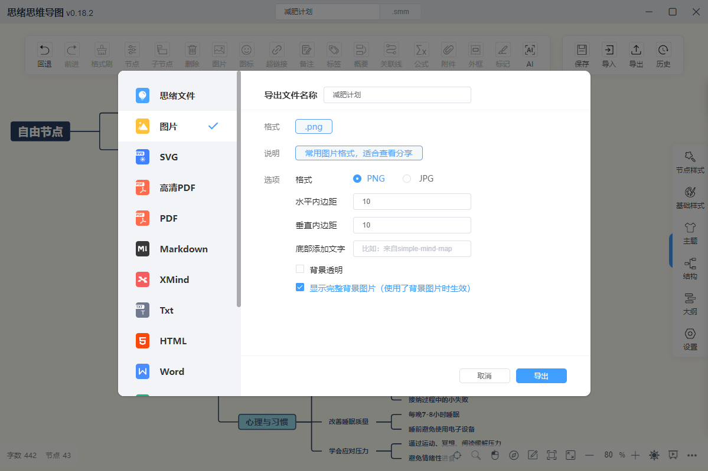
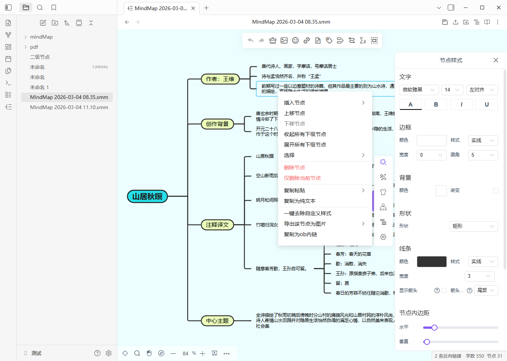
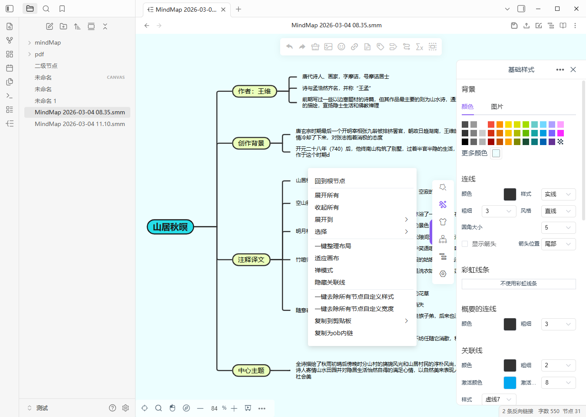
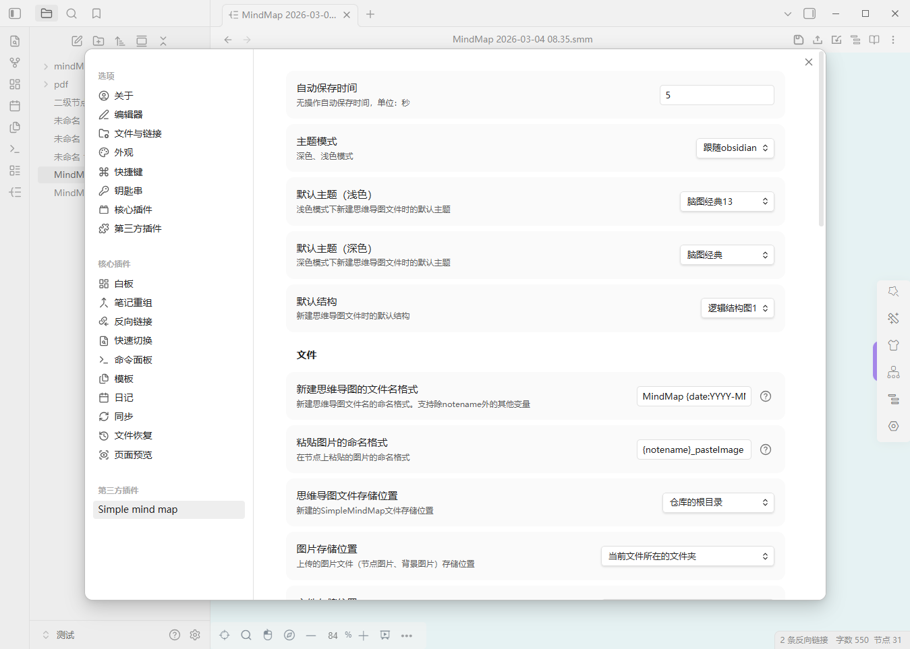
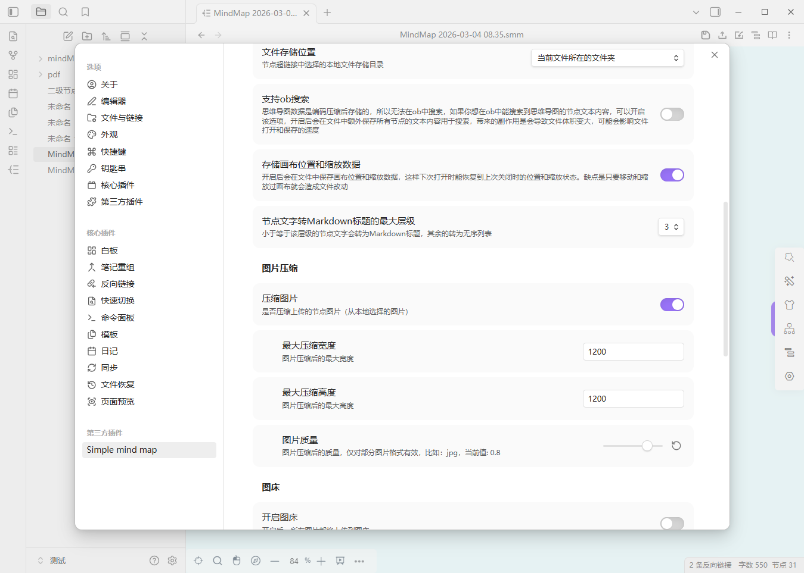
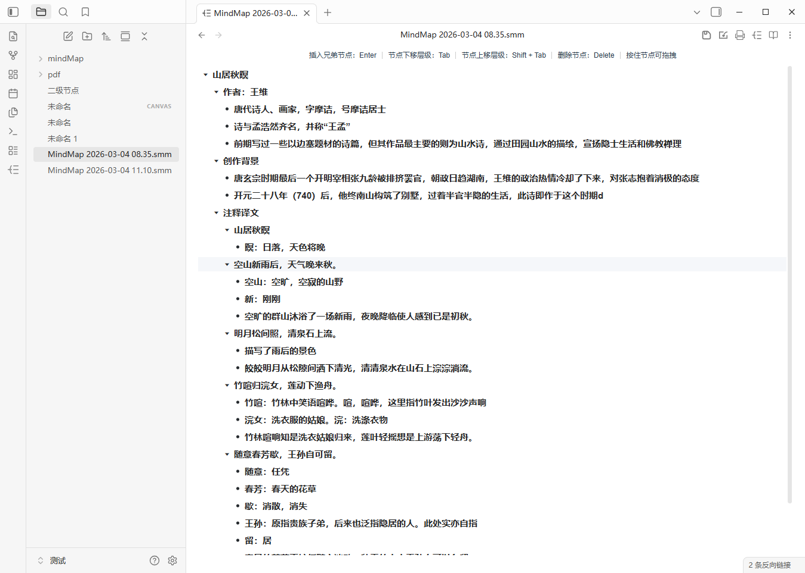

<h1 align="center">Simple mind map</h1>

[](https://www.npmjs.com/package/simple-mind-map)

[](https://github.com/wanglin2/mind-map/issues)

[](https://github.com/wanglin2/mind-map/stargazers)
[](https://github.com/wanglin2/mind-map/network/members)

[English](./README_EN.md) | 中文

> 中文名：思绪思维导图。一个简单&强大的 Web 思维导图库和思维导图软件。

本项目包含两部分：开源的JavaScript库和闭源的客户端软件。

# 库、Web

> 即本仓库中的代码，目前已进入低维护状态。

- 一个 `js` 思维导图库，不依赖任何框架，可以用来快速完成 Web 思维导图产品的开发。

>  开发文档：[https://wanglin2.github.io/mind-map-docs/](https://wanglin2.github.io/mind-map-docs/)

- 一个 Web 思维导图，基于思维导图库、`Vue2.x`、`ElementUI` 开发，支持操作电脑本地文件，可以当做一个在线版思维导图应用使用，也可以自部署和二次开发。

> 在线地址：[https://wanglin2.github.io/mind-map/](https://wanglin2.github.io/mind-map/)

了解更多信息：[README](./README_MORE_ZH.md)。

# 客户端、插件

> 客户端和插件代码不开源，正在积极开发维护中。

- 思绪思维导图客户端

本地化存储，隐私优先，数据安全，软件无需联网即可使用！

- [x] 1.支持创建无限数量的文件、节点（自由节点）；支持创建使用模板；
- [x] 2.提供丰富的设置：基础设置、自定义字体/快捷键/右键菜单/图标、图床配置、AI配置、webdav云同步配置等等，可玩性很高；
- [x] 3.支持思维导图、逻辑结构图、目录组织图、组织结构图、时间轴、鱼骨图、表格等多种结构类型；
- [x] 4.内置上百个丰富好看的主题，也支持自定义主题及AI生成主题；
- [x] 5.节点支持添加文本、图片、链接、图标、备注、附件、标签、概要节点、关联线、外框、标记、待办、描述、编号、数学公式等丰富内容；
- [x] 6.支持导入XMind、FreeMind、Markdown、Txt、Xlsx等格式文件；支持导出为PNG、XMind、SVG、PDF、Markdown、Txt、Xlsx、FreeMind、Mermaid、Html等格式；
- [x] 7.丰富的样式设置：文字、边框、背景、形状、线条、内外边距、图片标签布局等等；
- [x] 8.支持历史版本管理、演示模式、AI生成、手绘风格、大纲编辑、水印、滚动条、同级节点对齐、小地图、进入指定节点、彩虹线条、节点双向链接、搜索替换等等实用有趣的功能；

支持Windows、Mac及Linux系统；支持中文简体、繁體中文、English、Tiếng Việt、Русский、日本語、한국어、Deutsch、Français、Português语言。

下载地址：[Github](https://github.com/wanglin2/mind-map/releases)、[百度网盘](https://pan.baidu.com/s/1C8phEJ5pagAAa-o1tU42Uw?pwd=jqfb)、[夸克网盘](https://pan.quark.cn/s/2733982f1976)、[微软应用商店](https://apps.microsoft.com/detail/9p58vg94khcq?hl=zh-CN&gl=CN)

> 如果在macOS上安装后无法打开，报错**不受信任**或者**移到垃圾箱**，执行下面命令后再启动即可：
> ``` shell
> sudo xattr -d com.apple.quarantine /Applications/思绪思维导图.app
> ```





- Obsidian插件

下载地址：[Github](https://github.com/wanglin2/obsidian-simplemindmap/releases)











- UTools插件

已上架[uTools](https://www.u.tools/)插件应用市场，可直接在`uTools`插件应用市场中搜索`思绪`进行安装，也可以直接访问该地址：[主页](https://www.u-tools.cn/plugins/detail/%E6%80%9D%E7%BB%AA%E6%80%9D%E7%BB%B4%E5%AF%BC%E5%9B%BE/)，点击右侧的【启动】按钮进行安装。
