<h1 align="center">Simple mind map</h1>

[](https://www.npmjs.com/package/simple-mind-map)

[](https://github.com/wanglin2/mind-map/issues)

[](https://github.com/wanglin2/mind-map/stargazers)
[](https://github.com/wanglin2/mind-map/network/members)

English | [中文](./README.md)

> Chinese name: 思绪思维导图. A simple & powerful web mind map library and mind map software.

This project consists of two parts: an open-source JavaScript library and closed-source client software.

# Library, Web

> Refers to the code in this repository, currently in low-maintenance status.

- A `js` mind map library, independent of any framework, which can be used to quickly develop web-based mind map products.

> Documentation: [https://wanglin2.github.io/mind-map-docs/](https://wanglin2.github.io/mind-map-docs/)

- A web-based mind map application, developed using the mind map library, `Vue2.x`, and `ElementUI`. It supports operations on local computer files, can be used as an online mind map application, and is open for self-deployment and secondary development.

> Online address: [https://wanglin2.github.io/mind-map/](https://wanglin2.github.io/mind-map/)

Learn more: [README](./README_MORE_EN.md).

# Client, Plugins

> The client and plugin code are not open source and are under active development and maintenance.

- 思绪思维导图 Client

Local storage, privacy-first, data security. The software can be used without an internet connection!

- [x] 1. Supports creating unlimited files and nodes (free nodes); supports creating and using templates.
- [x] 2. Offers rich settings: basic settings, custom fonts/shortcuts/right-click menus/icons, image hosting configuration, AI configuration, WebDAV cloud sync configuration, etc., highly customizable.
- [x] 3. Supports various structure types: mind maps, logical structure diagrams, directory organization charts, organizational charts, timelines, fishbone diagrams, tables, etc.
- [x] 4. Built-in hundreds of rich and beautiful themes, also supports custom themes and AI-generated themes.
- [x] 5. Nodes support adding rich content: text, images, links, icons, notes, attachments, tags, summary nodes, association lines, borders, markers, to-dos, descriptions, numbering, mathematical formulas, etc.
- [x] 6. Supports importing files in XMind, FreeMind, Markdown, Txt, Xlsx, etc.; supports exporting to PNG, XMind, SVG, PDF, Markdown, Txt, Xlsx, FreeMind, Mermaid, Html, etc.
- [x] 7. Rich style settings: text, borders, background, shape, lines, inner/outer margins, image tag layout, etc.
- [x] 8. Supports practical and interesting features: historical version management, presentation mode, AI generation, hand-drawn style, outline editing, watermark, scrollbars, sibling node alignment, minimap, entering specific nodes, rainbow lines, bidirectional node linking, search and replace, etc.

Supports Windows, Mac, and Linux systems; supports 中文简体、繁體中文、English、Tiếng Việt、Русский、日本語、한국어、Deutsch、Français、Português languages.

Download links: [Github](https://github.com/wanglin2/mind-map/releases), [Baidu Netdisk](https://pan.baidu.com/s/1C8phEJ5pagAAa-o1tU42Uw?pwd=jqfb), [Quark Netdisk](https://pan.quark.cn/s/2733982f1976)、[Microsoft App Store](https://apps.microsoft.com/detail/9p58vg94khcq?hl=zh-CN&gl=CN)

> If the software fails to open after installation on macOS, showing an error like **untrusted** or **moved to trash**, execute the following command and then restart:
> ``` shell
> sudo xattr -d com.apple.quarantine /Applications/思绪思维导图.app
> ```

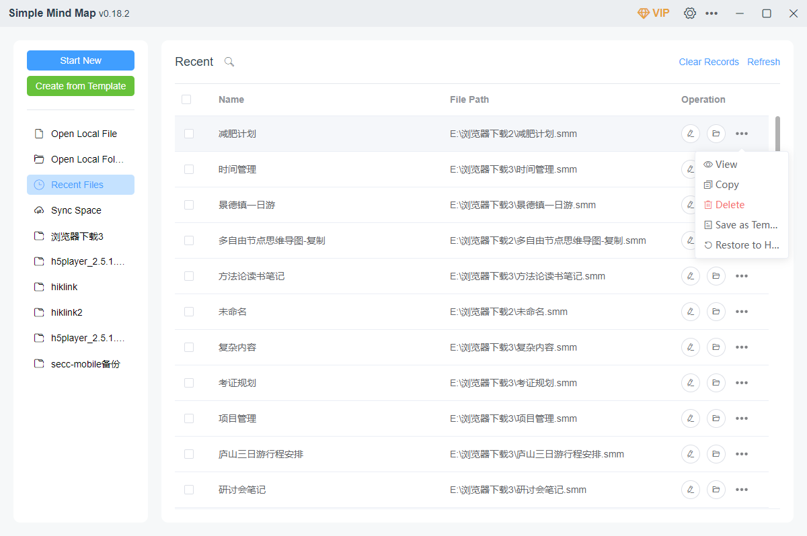

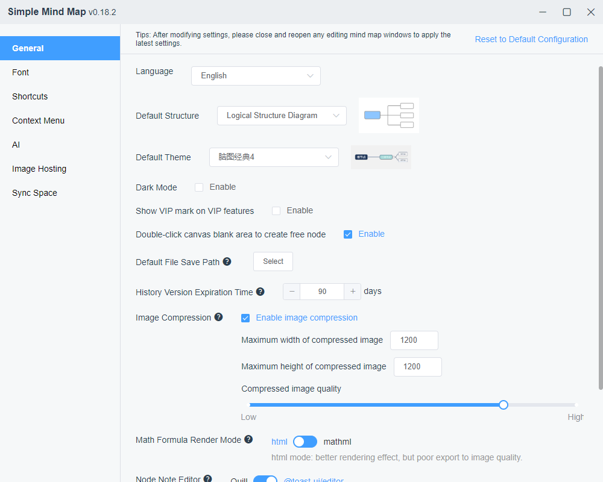

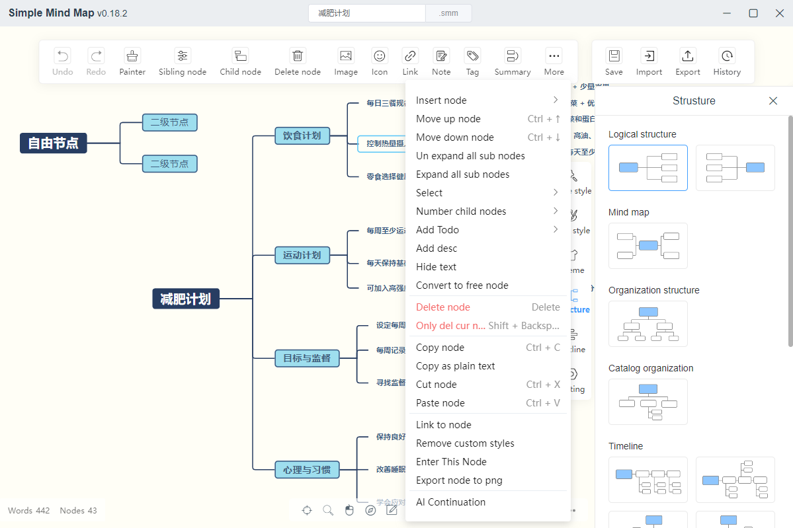

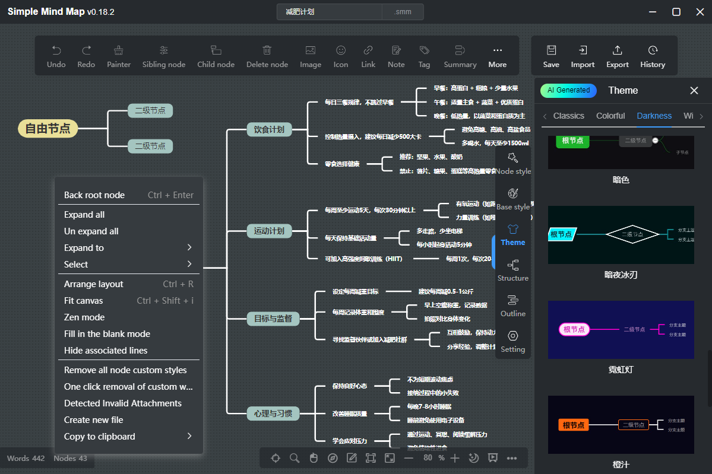

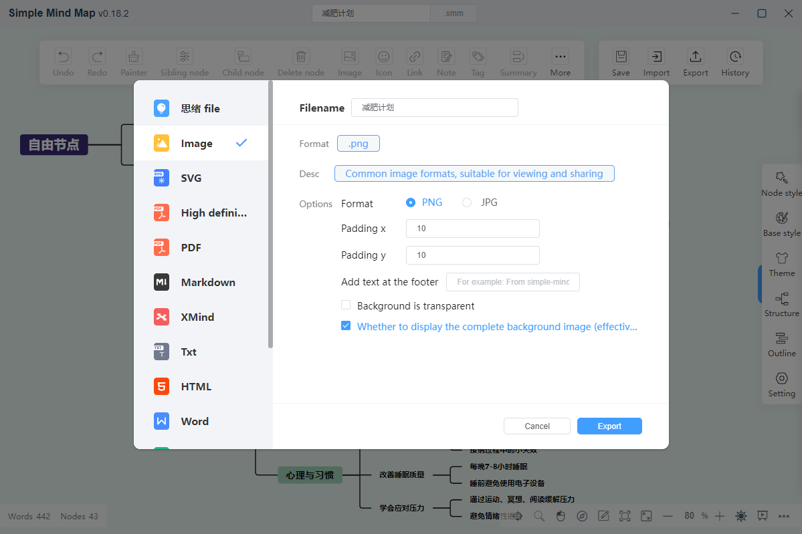

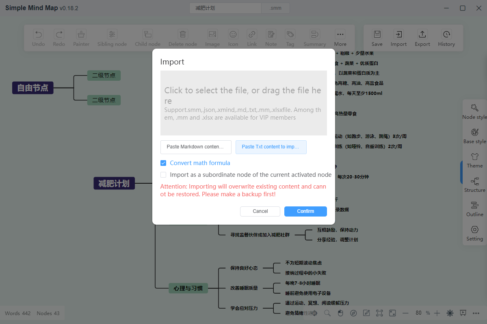

- Obsidian Plugin

Download link: [Github](https://github.com/wanglin2/obsidian-simplemindmap/releases)

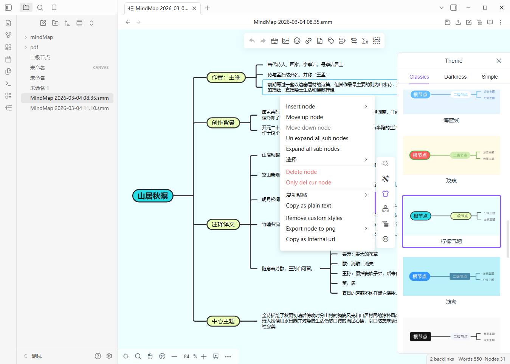

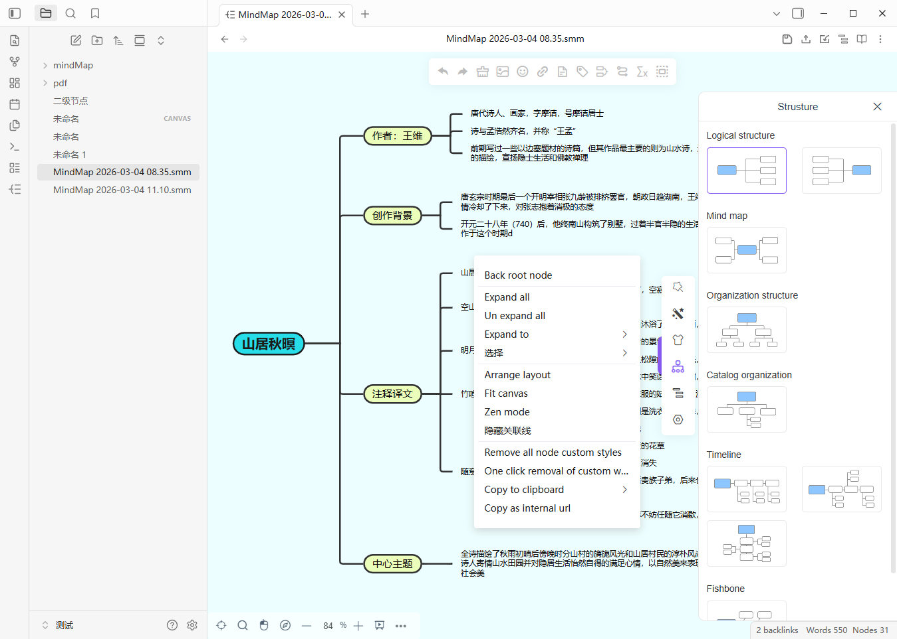

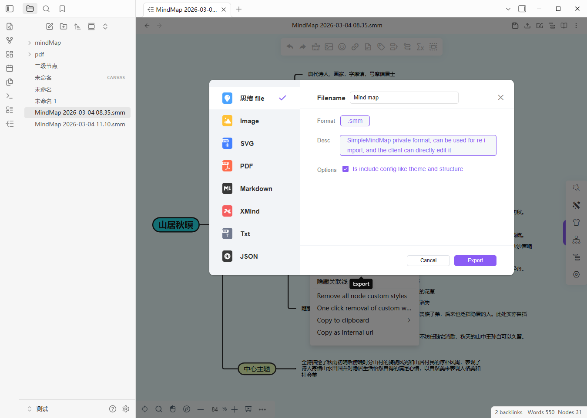

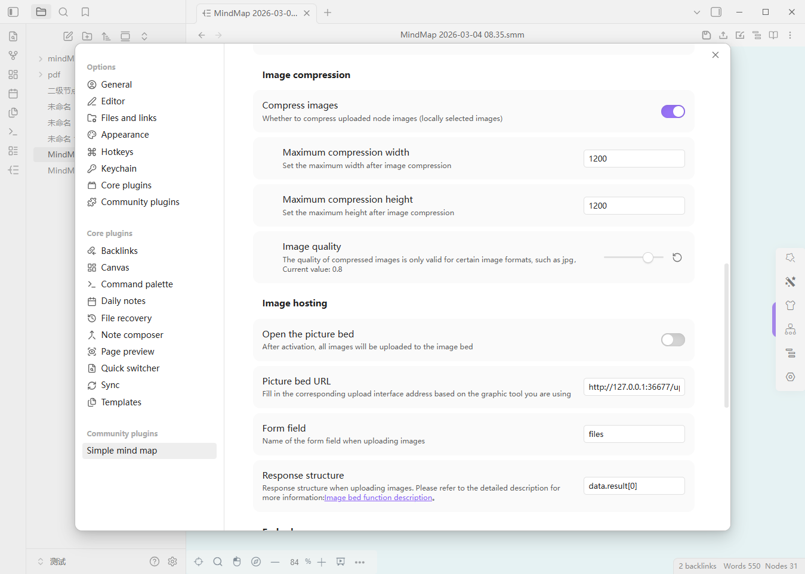

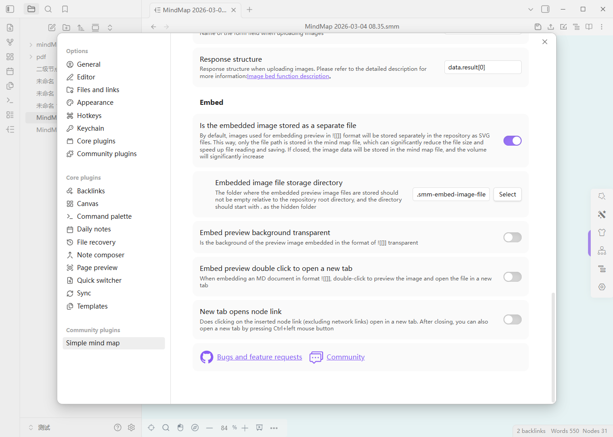

- UTools Plugin

Available in the [uTools](https://www.u.tools/) plugin market. You can search for `思绪` directly in the uTools plugin market to install it, or visit this address directly: [Homepage](https://www.u-tools.cn/plugins/detail/%E6%80%9D%E7%BB%AA%E6%80%9D%E7%BB%B4%E5%AF%BC%E5%9B%BE/), and click the 【Launch】 button on the right to install.