[TOC]

# 简介

思维导图是一种常见的表达发散性思维的有效工具，市面上有非常多的工具可以用来画思维导图，有免费的也有收费的，此外也有一些可以用来帮助快速实现的`JavaScript`类库，如：[jsMind](https://github.com/hizzgdev/jsmind)、[KityMinder](https://github.com/fex-team/kityminder)。

本文会完整的介绍如何从头实现一个简易的思维导图，最终成果预览：[https://wanglin2.github.io/mind-map/](https://wanglin2.github.io/mind-map/)。


# 技术选型

这种图形类的绘制一般有两种选择：`svg`与`canvas`，因为思维导图主要是节点与线的连接，使用与`html`比较接近的`svg`比较容易操作，`svg`的类库在试用了[svgjs](https://svgjs.dev/docs/3.0/)和[snap](http://snapsvg.io/)后，有些需求在`snap`里没有找到对应的方法，所以笔者最终选择了`svgjs`，为了能跨框架使用，所以思维导图的主体部分作为一个单独的`npm`包来开发及发布，通过`类`的方式来组织代码，示例页面的开发使用的是`vue2.x`全家桶。


# 整体思路

笔者最初的思路是先写一个渲染器，根据输入的思维导图数据，可以渲染成`svg`节点，并且计算好各个节点的位置，然后定位显示到画布，连上线即可，接下来对思维导图的操作都只需要维护这份数据，数据变化了就清空画布，然后重新渲染，这种数据驱动的思想很简单，在最初的开发中也没有任何问题，一切都很顺利，因为模拟数据就写了四五个节点，然而后来当我把节点数量增加到几十个的时候，发现凉了，太卡了，点击节点激活或者展开收缩节点的时候一秒左右才有反应。

卡的原因一方面是因为计算节点位置，每种布局结构最少都需要三次遍历节点树，加上一些计算逻辑，会比较耗时，另一方面是因为渲染节点内容，因为一个思维导图节点除了文本，还要支持图片、图标、标签等信息、`svg`不像`html`会自动按流式布局来帮你排版，所以每种信息都需要先创建对应的`svg`元素，然后计算其宽高，还要根据其他信息节点计算其位置，最后还要再根据所有这些内容子节点来计算节点整体的宽高，所以也是很耗时的一个操作。并且因为`svg`元素也算是`dom`节点，所以数量多了又要频繁操作，当然就卡了。

卡顿的原因找到了，怎么解决呢？一种方法是不用`svg`，改用`canvas`，但是笔者发现该问题的时候已经写了较多代码了，所以采用的方法的是不再每次都完全重新渲染，而是按需进行渲染，比如点击节点激活该节点的时候，不需要重新渲染其他节点，只需要重新渲染被点击的节点就可以了，又比如某个节点收缩或展开时，其他节点只是位置需要变化，节点内容并不需要重新渲染，所以只需要重新计算其他节点的位置并把它们移动过去即可，这样额外的好处是还可以让它们通过动画的方式移动过去，其他相关的操作也是如此，尽量只更新必要的节点和进行必要的操作，重构完后虽然还是会存在一定卡顿的现象，但是相比之前已经好了很多。


# 数据结构

思维导图可以看成就是一棵树，所以基本的结构就是树的结构，每个节点保存节点本身的信息再加上子节点的信息，对于一个具体的节点来说，大概需要包含节点的各种内容（文本、图片、图标等固定格式）、节点展开状态、子节点等等，此外还要包括该节点的特定样式，用来覆盖主题的默认样式，这样可以对每个节点进行个性化：

```json
{
  "data": {
    "text": "根节点",
    "expand": true,
    "color": "#fff",
    // ...
    "children": []
  }
```

详细结构可参考：[节点结构](https://github.com/wanglin2/mind-map/blob/main/simple-mind-map/example/exampleData.js)。

仅有这棵数据树是不够的，我们需要再定义一个节点类，当遍历数据树的时候，每个节点都会创建一个节点实例，用来保存该节点的状态，执行渲染、计算宽高、绑定事件等等操作：

```js
// 节点类
class Node {
  constructor(opt = {}) {
    this.nodeData = opt.data// 节点真实数据，就是上述说的数据结构
    this.isRoot =  opt.isRoot// 是否是根节点
    this.layerIndex = opt.layerIndex// 节点层级
    this.width = 0// 节点宽
    this.height = 0// 节点高
    this.left = opt.left || 0// left
    this.top = opt.top || 0// top
    this.parent = opt.parent || null// 父节点
    this.children = []// 子节点
    // ...
  }
  
  // ...
}
```

因为一个节点可能包含文本、图片等多种信息，所以我们使用一个`g`元素来作为节点容器，文本就创建一个`text`节点，需要边框的话就再创建一个`rect`节点，节点的最终大小就是文本节点的大小再加上内边距，比如我们要渲染一个带边框的只有文本的节点：

```js
import {
    G,
    Rect,
    Text
} from '@svgdotjs/svg.js'
class Node {
  constructor(opt = {}) {
    // ...
    this.group = new G()// 节点容器
    this.getSize()
    this.render()
  }
  // 计算节点宽高
  getSize() {
    let textData = this.createTextNode()
    this.width = textData.width + 20// 左右内边距各10
    this.height = textData.height + 10// 上下内边距各5
  }
  // 创建文本节点
  createTextNode() {
    let node = new Text().text(this.nodeData.data.text)
    let { width, height } = node.bbox()// 获取文本节点的宽高
    return {
      node: g,
      width,
      height
    }
  }
  // 渲染节点
  render() {
    let textData = this.createTextNode()
    textData.node.translate(10, 5)// 文字节点相对于容器偏移内边距的大小
    // 创建一个矩形来作为边框
    this.group.rect(this.width, this.height).x(0).y(0)
    // 文本节点添加到节点容器里
    this.group.add(textData.node)
    // 容器添加到画布上
    this.draw.add(this.group)
  }
}
```

如果还需要渲染图片的话，就需要再创建一个`image`节点，那么节点的总高度就需要再加上图片的高，节点的总宽就是图片和文字中较宽的那个大小，文字节点的位置计算也需要根据节点的总宽度及文字节点的宽度来计算，需要再渲染其他类型的信息也是一样，总之，所有节点的位置都需要自行计算，还是有点繁琐的。

节点类完整代码请看：[Node.js](https://github.com/wanglin2/mind-map/blob/main/simple-mind-map/src/Node.js)。


# 逻辑结构图

思维导图有多种结构，我们先看最基础的【逻辑结构图】如何进行布局计算，其他的几种会在下一篇里进行介绍。

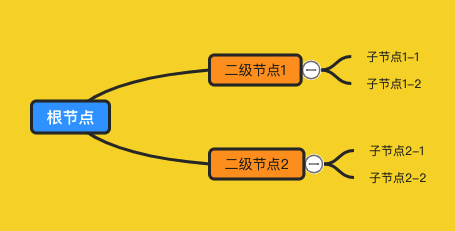

逻辑结构图如上图所示，子节点在父节点的右侧，然后父节点相对于子节点总体来说是垂直居中的。


## 节点定位

这个思路源于笔者在网上看到的，首先根节点我们把它定位到画布中间的位置，然后遍历子节点，那么子节点的`left`就是根节点的`left `+根节点的`width`+它们之间的间距`marginX`，如下图所示：

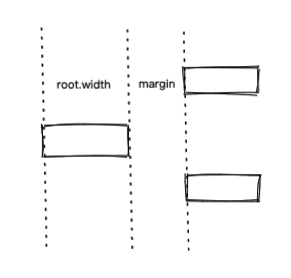

然后再遍历每个子节点的子节点（其实就是递归遍历）以同样的方式进行计算`left`，这样一次遍历完成后所有节点的`left`值就计算好了。

```js
// 第一次遍历数据树
walk(this.renderer.renderTree, null, (cur, parent, isRoot, layerIndex) => {
  // 先序遍历
  // 创建节点实例
  let newNode = new Node({
    data: cur,
    layerIndex
  })
  // 节点实例关联到节点数据上
  cur._node = newNode
  // 根节点
  if (isRoot) {
    this.root = newNode
    // 定位在画布中心位置
    newNode.left = (this.mindMap.width - node.width) / 2
    newNode.top = (this.mindMap.height - node.height) / 2
  } else {
    // 非根节点
    // 互相收集
    newNode.parent = parent._node
    parent._node.addChildren(newNode)
    // 定位到父节点右侧
    newNode.left = parent._node.left + parent._node.width + marginX
  }
}, null, true, 0)
```

接下来是`top`，首先最开始也是只有根节点的`top`是确定的，那么子节点怎么根据父节点的`top`进行定位呢？上面说过每个节点是相对于其所有子节点居中显示的，那么如果我们知道所有子节点的总高度，那么第一个子节点的`top`也就确定了：

```js
firstChildNode.top = (node.top + node.height / 2) - childrenAreaHeight / 2
```

如图所示：

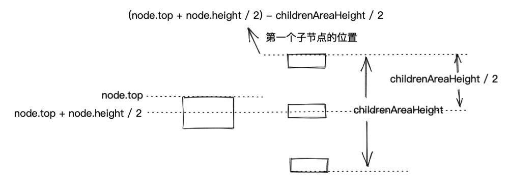

第一个子节点的`top`确定了，其他节点只要在前一个节点的`top`上累加即可。

那么怎么计算`childrenAreaHeight`呢？首先第一次遍历到一个节点时，我们会给它创建一个`Node`实例，然后触发计算该节点的大小，所以只有当所有子节点都遍历完回来后我们才能计算总高度，那么显然可以在后序遍历的时候来计算，但是要计算节点的`top`只能在下一次遍历时，为什么不在计算完一个节点的`childrenAreaHeight`后立即就计算其子节点的`top`呢？原因很简单，当前节点的`top`都还没确定，怎么确定其子节点的位置呢？

```js
walk(this.renderer.renderTree, null, (cur, parent, isRoot, layerIndex) => {
  // 先序遍历
  // ...
}, (cur, parent, isRoot, layerIndex) => {
  // 后序遍历
  // 计算该节点所有子节点所占高度之和，包括节点之间的margin
  cur._node.childrenAreaHeight = cur._node.children.reduce((h, node) => {
    return h + node.height
  }, 0) + (len + 1) * marginY
}, true, 0)
```

总结一下，在第一轮遍历数据树时，我们在先序遍历时创建`Node`实例，然后计算节点的`left`，在后序遍历时计算每个节点的所有子节点的所占的总高度。

接下来开启第二轮遍历，这轮遍历可以计算所有节点的`top`，因为此时节点树已经创建成功了，所以可以不用再遍历数据树，直接遍历节点树：

```js
walk(this.root, null, (node, parent, isRoot, layerIndex) => {
  if (node.children && node.children.length > 0) {
    // 第一个子节点的top值 = 该节点中心的top值 - 子节点的高度之和的一半
    let top = node.top + node.height / 2 - node.childrenAreaHeight / 2
    let totalTop = top + marginY// node.childrenAreaHeight是包括子节点整体两侧的间距的
    node.children.forEach((cur) => {
      cur.top = totalTop
      totalTop += cur.height + marginY// 在上一个节点的top基础上加上间距marginY和该节点的height
    })
  }
}, null, true)
```

事情到这里并没有结束，请看下图：

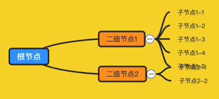

可以看到对于每个节点来说，位置都是正确的，但是，整体来看就不对了，因为发生了重叠，原因很简单，因为【二级节点1】的子节点太多了，子节点占的总高度已经超出了该节点自身的高，因为【二级节点】的定位是依据【二级节点】的总高度来计算的，并没有考虑其子节点，解决方法也很简单，再来一轮遍历，当发现某个节点的子节点所占总高度大于其自身的高度时，就让该节点前后的节点都往外挪一挪，比如上图，假设子节点所占的高度比节点自身的高度多出了`100px`，那我们就让【二级节点2】向下移动`50px`，如果它上面还有节点的话也让它向上移动`50px`，需要注意的是，这个调整的过程需要一直往父节点上冒泡，比如：

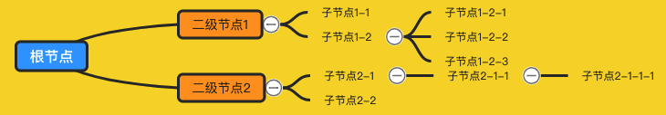

【子节点1-2】的子元素总高度明显大于其自身，所以【子节点1-1】需要往上移动，这样显然还不够，假设上面还有【二级节点0】的子节点，那么它们可能也要发生重叠了，而且下方的【子节点2-1-1】和【子节点1-2-3】显然挨的太近了，所以【子节点1-1】自己的兄弟节点调整完后，父节点【二级节点1】的兄弟节点也需要同样进行调整，上面的往上移，下面的往下移，一直到根节点为止：

```js
// 第三次遍历
walk(this.root, null, (node, parent, isRoot, layerIndex) => {
  // 判断子节点所占的高度之和((除去子节点整体前后的margin))是否大于该节点自身
  let difference = node.childrenAreaHeight - marginY * 2 - node.height
  // 大于则前后的兄弟节点需要调整位置
  if (difference > 0) {
    this.updateBrothers(node, difference / 2)
  }
}, null, true)
```

`updateBrothers`用来向上递归移动节点：

```js
updateBrothers(node, addHeight) {
  if (node.parent) {
    let childrenList = node.parent.children
    // 找到自己处于第几个节点
    let index = childrenList.findIndex((item) => {
      return item === node
    })
    childrenList.forEach((item, _index) => {
      if (item === node) {
        return
      }
      let _offset = 0
      // 上面的节点往上移
      if (_index < index) {
        _offset = -addHeight
      } else if (_index > index) { // 下面的节点往下移
        _offset = addHeight
      }
      // 移动节点
      item.top += _offset
      // 节点自身移动了，还需要同步移动其所有下级节点
      if (item.children && item.children.length) {
        this.updateChildren(item.children, 'top', _offset)
      }
    })
    // 向上遍历，移动父节点的兄弟节点
    this.updateBrothers(node.parent, addHeight)
  }
}
```

```js
// 更新节点的所有子节点的位置
updateChildren(children, prop, offset) {
  children.forEach((item) => {
    item[prop] += offset
    if (item.children && item.children.length) {
      this.updateChildren(item.children, prop, offset)
    }
  })
}
```

到此【逻辑结构图】的整个布局计算就完成了，当然，有一个小小小的问题：

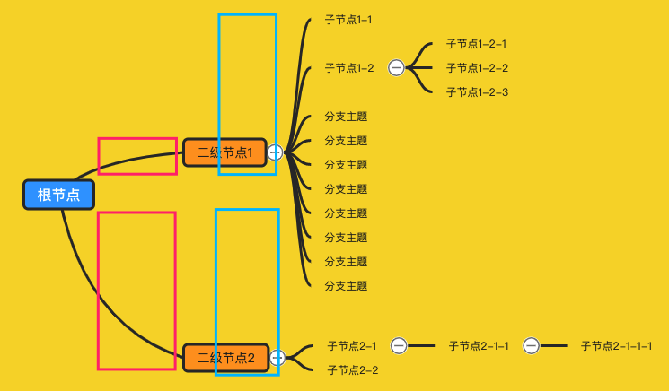

就是严格来说，某个节点可能不再相对于其所有子节点居中了，而是相对于所有子孙节点居中，其实这样问题不大，实在有洁癖的话，解决方法也有，各位可以自行思考一下，这部分完整代码请移步[LogicalStructure.js](https://github.com/wanglin2/mind-map/blob/main/simple-mind-map/src/layouts/LogicalStructure.js)。


## 节点连线

节点定位好了，接下来就要进行连线，把节点和其所有子节点连接起来，连线风格有很多，可以使用直线，也可以使用曲线，直线的话很简单，因为所有节点的`left`、`top`、`width`、`height`都已经知道了，所以连接线的转折点坐标都可以轻松计算出来：

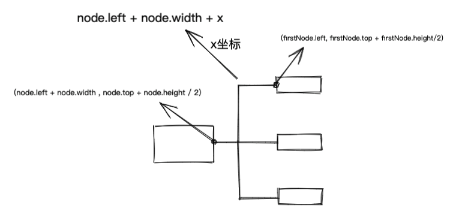

我们重点看一下曲线连接，如之前的图片所示，根节点的连线和其他节点的线是不一样的，根节点到其子节点的如下所示：

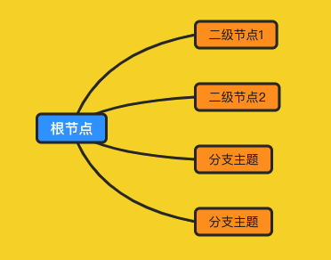

这种简单的曲线可以使用二次贝塞尔曲线，起点坐标为根节点的中间点：

```js
let x1 = root.left + root.width / 2
let y1 = root.top + root.height / 2
```

终点坐标为各个子节点的左侧中间：

```js
let x2 = node.left
let y2 = node.top + node.height / 2
```

那么只要确定一个控制点即可，具体这个点可以自己[调节](https://cubic-bezier.com/#0,0,.11,.9)，找一个看的顺眼的位置即可，笔者最终选择的是：

```js
let cx = x1 + (x2 - x1) * 0.2
let cy = y1 + (y2 - y1) * 0.8）
```

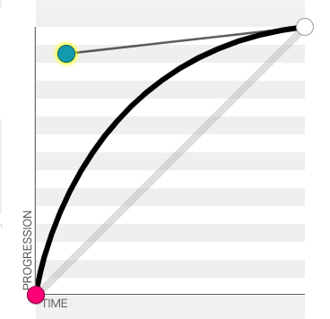

再看下级节点的连线：

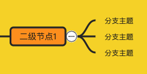

可以看到有两段弯曲，所以需要使用三次贝塞尔曲线，也是一样，自己选择两个合适的控制点位置，笔者的选择如下图，就是处于起点和终点的中间：

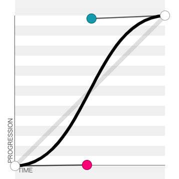

```js
  let cx1 = x1 + (x2 - x1) / 2
  let cy1 = y1
  let cx2 = cx1
  let cy2 = y2
```

接下来给`Node`类加个渲染连线的方法即可：

```js
class Node {
  // 渲染节点到其子节点的连线
  renderLine() {
    let { layerIndex, isRoot, top, left, width, height } = this
    this.children.forEach((item, index) => {
      // 根节点的连线起点在节点中间，其他都在右侧
      let x1 = layerIndex === 0 ? left + width / 2 : left + width
      let y1 = top + height / 2
      let x2 = item.left
      let y2 = item.top + item.height / 2
      let path = ''
      if (isRoot) {
        path = quadraticCurvePath(x1, y1, x2, y2)
      } else {
        path = cubicBezierPath(x1, y1, x2, y2)
      }
      // 绘制svg路径到画布
      this.draw.path().plot(path)
    })
  }
}

// 根节点到其子节点的连线
const quadraticCurvePath = (x1, y1, x2, y2) => {
  // 二次贝塞尔曲线的控制点
  let cx = x1 + (x2 - x1) * 0.2
  let cy = y1 + (y2 - y1) * 0.8
  return `M ${x1},${y1} Q ${cx},${cy} ${x2},${y2}`
}

// 其他节点到其子节点的连线
const cubicBezierPath = (x1, y1, x2, y2) => {
  // 三次贝塞尔曲线的两个控制点
  let cx1 = x1 + (x2 - x1) / 2
  let cy1 = y1
  let cx2 = cx1
  let cy2 = y2
  return `M ${x1},${y1} C ${cx1},${cy1} ${cx2},${cy2} ${x2},${y2}`
}
```


# 节点激活

点击某个节点就相对于把它激活，为了能有点反馈，所以需要给它加一点激活的样式，通常都是给它加个边框，但是笔者不满足于此，笔者觉得节点所有的样式，激活时都可以改变，也就是有两种状态，普通状态和激活状态，它们可以设置的样式都是一样的。

监听节点的单击事件，设置节点的激活标志，因为同时是可以存在多个激活节点的，所以用一个数组来保存所有的激活节点。

```js
class Node {
  bindEvent() {
    this.group.on('click', (e) => {
      e.stopPropagation()
      // 已经是激活状态就直接返回
      if (this.nodeData.data.isActive) {
        return
      }
      // 清除当前已经激活节点的激活状态
      this.renderer.clearActive()
      // 执行激活点击节点的激活状态的命令
      this.mindMap.execCommand('SET_NODE_ACTIVE', this, true)
      // 添加到激活列表里
      this.renderer.addActiveNode(this)
    })
  }
}
```

`SET_NODE_ACTIVE`命令会重新渲染该节点，所以我们只要在渲染节点的逻辑里判断节点的激活状态来应用不同的样式即可，具体在后序的样式与主题小节里细说。


# 文字编辑

文字编辑比较简单，监听节点容器的双击事件，然后获取文字节点的宽高和位置，最后再盖一个编辑层在上面即可，编辑完监听回车键，隐藏编辑层，修改节点数据然后重新渲染该节点，如果节点大小变化了就更新其他节点的位置。

```js
class Node {
  // 绑定事件
  bindEvent() {
    this.group.on('dblclick', (e) => {
      e.stopPropagation()
      this.showEditTextBox()
    })
  }
  
  // 显示文本编辑层
  showEditTextBox() {
    // 获取text节点的位置和尺寸信息
    let rect = this._textData.node.node.getBoundingClientRect()
    // 文本编辑层节点没有创建过就创建一个
    if (!this.textEditNode) {
      this.textEditNode = document.createElement('div')
      this.textEditNode.style.cssText = `
				position:fixed;
        box-sizing: border-box;
        background-color:#fff;
        box-shadow: 0 0 20px rgba(0,0,0,.5);
        padding: 3px 5px;
        margin-left: -5px;
        margin-top: -3px;
        outline: none;`
      this.textEditNode.setAttribute('contenteditable', true)
      document.body.appendChild(this.textEditNode)
    }
    // 把文字的换行符替换成换行节点
    this.textEditNode.innerHTML = this.nodeData.data.text.split(/\n/img).join('<br>')
    // 定位和显示文本编辑框
    this.textEditNode.style.minWidth = rect.width + 10 + 'px'
    this.textEditNode.style.minHeight = rect.height + 6 + 'px'
    this.textEditNode.style.left = rect.left + 'px'
    this.textEditNode.style.top = rect.top + 'px'
    this.textEditNode.style.display = 'block'
  }
}
```

有个小细节，就是当节点支持个性化的时候，需要把节点文字的样式，比如`font-size`、`line-height`之类样式也要设置到这个编辑节点上，这样可以尽量保持一致性，虽然是个盖上去的层，但是并不会让人感觉很突兀。

```js
class Node {
  // 注册快捷键
  registerCommand() {
    // 注册回车快捷键
    this.mindMap.keyCommand.addShortcut('Enter', () => {
      this.hideEditTextBox()
    })
  }

  // 关闭文本编辑框
  hideEditTextBox() {
    // 遍历当前激活的节点列表，修改它们的文字信息
    this.renderer.activeNodeList.forEach((node) => {
      // 这个方法会去掉html字符串里的标签及把br标签替换成\n
      let str = getStrWithBrFromHtml(this.textEditNode.innerHTML)
      // 执行设置节点文本的命令
      this.mindMap.execCommand('SET_NODE_TEXT', this, str)
      // 更新其他节点
      this.mindMap.render()
    })
    // 隐藏文本编辑层
    this.textEditNode.style.display = 'none'
    this.textEditNode.innerHTML = ''
  }
}
```

上面涉及到了两个东西，一个是注册快捷键，另一个是执行命令，这两个话题后面的小节里会进行介绍，节点编辑类完整代码：[TextEdit.js](https://github.com/wanglin2/mind-map/blob/main/simple-mind-map/src/TextEdit.js).


# 展开与收起

有时候节点太多了，我们不需要全部都显示，那么可以通过展开和收起来只显示需要的节点，首先需要给有子节点的节点渲染一个展开收起按钮，然后绑定点击事件，切换节点的展开和收缩状态：

```js
class Node {
  renderExpandBtn() {
    // 没有子节点或是根节点直接返回
    if (!this.nodeData.children || this.nodeData.children.length <= 0 || this.isRoot) {
      return
    }
    // 按钮容器
    this._expandBtn = new G()
    let iconSvg
    // 根据节点的展开状态来判断渲染哪个图标，oepn与close都是svg字符串
    if (this.nodeData.data.expand === false) {
      iconSvg = btnsSvg.open
    } else {
      iconSvg = btnsSvg.close
    }
    let node = SVG(iconSvg).size(this.expandBtnSize, this.expandBtnSize)
    // 因为图标都是路径path元素，鼠标很难点击到，所以渲染一个透明的圆来响应鼠标事件
    let fillNode = new Circle().size(this.expandBtnSize)
    // 添加到容器里
    this._expandBtn.add(fillNode).add(node)
    // 绑定点击事件
    this._expandBtn.on('click', (e) => {
      e.stopPropagation()
      // 展开收缩
      this.mindMap.execCommand('SET_NODE_EXPAND', this, !this.nodeData.data.expand)
    })
    // 设置按钮的显示位置，显示到节点的右侧垂直居中的位置
    this._expandBtn.translate(width, height / 2)
    // 添加到节点的容器里
    this.group.add(this._expandBtn)
  }
}
```

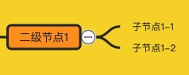

`SET_NODE_EXPAND`命令会设置节点的展开收起状态，并渲染或删除其所有子孙节点，达到展开或收起的效果，并且还需要重新计算和移动所有节点的位置，遍历树计算位置的相关代码也需要加上这个判断：

```js
// 第一次遍历
walk(this.renderer.renderTree, null, (cur, parent, isRoot, layerIndex) => {
  // ...
}, (cur, parent, isRoot, layerIndex) => {
  // 后序遍历
  if (cur.data.expand) {
    cur._node.childrenAreaHeight = cur._node.children.reduce((h, node) => {
      return h + node.height
    }, 0) + (len + 1) * marginY
  } else {// 如果该节点为收起状态，那么其childrenAreaHeight显然应该为0
    cur._node.childrenAreaHeight = 0
  }
}, true, 0)
```

```js
// 第二次遍历
walk(this.root, null, (node, parent, isRoot, layerIndex) => {
  // 收起状态的子节点就不用计算了
  if (node.nodeData.data.expand && node.children && node.children.length > 0) {
    let top = node.top + node.height / 2 - node.childrenAreaHeight / 2
    // ...
  }
}, null, true)
```

```js
// 第三次遍历
walk(this.root, null, (node, parent, isRoot, layerIndex) => {
  // 收起状态不用再去判断子节点高度
  if (!node.nodeData.data.expand) {
    return;
  }
  let difference = node.childrenAreaHeight - marginY * 2 - node.height
  // ...
  }, null, true)
```


到这里，一个基本可用的思维导图就完成了。


# 命令

上面的代码已经涉及到几个命令了，我们把会修改节点状态的操作通过命令来调用，每调用一个命令就会保存一份当前的节点数据副本，用来回退和前进。

命令类似于发布订阅者，先注册命令，然后再触发命令的执行：

```js
class Command {
  constructor() {
    // 保存命令
    this.commands = {}
    // 保存历史副本
    this.history = []
    // 当前所在的历史位置
    this.activeHistoryIndex = 0
  }

  // 添加命令
  add(name, fn) {
    if (this.commands[name]) {
      this.commands[name].push(fn)
    } else[
      this.commands[name] = [fn]
    ]
  }

  // 执行命令
  exec(name, ...args) {
    if (this.commands[name]) {
      this.commands[name].forEach((fn) => {
        fn(...args)
      })
      // 保存当前数据副本到历史列表里
      this.addHistory()
    }
  }

  // 保存当前数据副本到历史列表里
  addHistory() {
    // 深拷贝一份当前数据
    let data = this.getCopyData()
    this.history.push(data)
    this.activeHistoryIndex = this.history.length - 1
  }
}
```

比如之前的`SET_NODE_ACTIVE`命令会先注册：

```js
class Render {
  registerCommand() {
    this.mindMap.command.add('SET_NODE_ACTIVE', this.setNodeActive)
  }

  // 设置节点是否激活
  setNodeActive(node, active) {
    this.setNodeData(node, {
      isActive: active
    })
    node.renderNode()
  }
}
```


# 回退与前进

上一节的命令里已经保存了所有操作后的副本数据，所以回退和前进就只要操作指针`activeHistoryIndex`，然后获取到这个位置的历史数据，复制一份替换当前的数据树，最后再触发重新渲染即可，这里会进行整体全部的重新渲染，所以会稍微有点卡顿。

```js
class Command {
  // 回退
  back(step = 1) {
    if (this.activeHistoryIndex - step >= 0) {
      this.activeHistoryIndex -= step
      return simpleDeepClone(this.history[this.activeHistoryIndex]);
    }
  }

  // 前进
  forward(step = 1) {
    let len = this.history.length
    if (this.activeHistoryIndex + step <= len - 1) {
      this.activeHistoryIndex += step
      return simpleDeepClone(this.history[this.activeHistoryIndex]);
    }
  }
}
```

```js
class Render {
  // 回退
  back(step) {
    let data = this.mindMap.command.back(step)
    if (data) {
      this.renderTree = data
      this.mindMap.reRender()
    }
  }

  // 前进
  forward(step) {
    let data = this.mindMap.command.forward(step)
    if (data) {
      this.renderTree = data
      this.mindMap.reRender()
    }
  }
}
```


# 样式与主题

主题包括节点的所有样式，比如颜色、填充、字体、边框、内边距等等，也包括连线的粗细、颜色，及画布的背景颜色或图片等等。

一个主题的结构大致如下：

```js
export default {
    // 节点内边距
    paddingX: 15,
    paddingY: 5,
    // 连线的粗细
    lineWidth: 1,
    // 连线的颜色
    lineColor: '#549688',
    // 背景颜色
    backgroundColor: '#fafafa',
    // ...
    // 根节点样式
    root: {
        fillColor: '#549688',
        fontFamily: '微软雅黑, Microsoft YaHei',
        color: '#fff',
        // ...
        active: {
            borderColor: 'rgb(57, 80, 96)',
            borderWidth: 3,
            borderDasharray: 'none',
            // ...
        }
    },
    // 二级节点样式
    second: {
        marginX: 100,
        marginY: 40,
        fillColor: '#fff',
        // ...
        active: {
            // ...
        }
    },
    // 三级及以下节点样式
    node: {
        marginX: 50,
        marginY: 0,
        fillColor: 'transparent',
        // ...
        active: {
            // ...
        }
    }
}
```

最外层的是非节点样式，对于节点来说，也分成了三种类型，分别是根节点、二级节点及其他节点，每种节点里面有分成了常态样式和激活时的样式，它们能设置的样式是完全一样的，完整结构请看[default.js](https://github.com/wanglin2/mind-map/blob/main/simple-mind-map/src/themes/default.js)。

创建节点的每个信息元素时都会给它应用相关的样式，比如之前提到的文本元素和边框元素：

```js
class Node {
  // 创建文本节点
  createTextNode() {
    let node = new Text().text(this.nodeData.data.text)
    // 给文本节点应用样式
    this.style.text(node)
    let { width, height } = node.bbox()
    return {
      node: g,
      width,
      height
    }
  }
  
  // 渲染节点
  render() {
    let textData = this.createTextNode()
    textData.node.translate(10, 5)
    // 给边框节点应用样式
    this.style.rect(this.group.rect(this.width, this.height).x(0).y(0))
    // ...
  }
}
```

`style`是样式类`Style`的实例，每个节点都会实例化一个（其实没必要，后续可能会修改），用来给各种元素设置样式，它会根据节点的类型和激活状态来选择不同的样式：

```js
class Style {
  // 给文本节点设置样式
  text(node) {
    node.fill({
      color: this.merge('color')
    }).css({
      'font-family': this.merge('fontFamily'),
      'font-size': this.merge('fontSize'),
      'font-weight': this.merge('fontWeight'),
      'font-style': this.merge('fontStyle'),
      'text-decoration': this.merge('textDecoration')
    })
  }
}
```

`merge`就是用来判断使用什么哪个样式的方法：

```js
class Style {
  // root不是根节点，而是代表非节点的样式
  merge(prop, root) {
    // 三级及以下节点的样式
    let defaultConfig = this.themeConfig.node
    if (root) {// 非节点的样式
      defaultConfig = this.themeConfig
    } else if (this.ctx.layerIndex === 0) {// 根节点
      defaultConfig = this.themeConfig.root
    } else if (this.ctx.layerIndex === 1) {// 二级节点
      defaultConfig = this.themeConfig.second
    }
    // 激活状态
    if (this.ctx.nodeData.data.isActive) {
      // 如果节点有单独设置了样式，那么优先使用节点的
      if (this.ctx.nodeData.data.activeStyle && this.ctx.nodeData.data.activeStyle[prop] !== undefined) {
        return this.ctx.nodeData.data.activeStyle[prop];
      } else if (defaultConfig.active && defaultConfig.active[prop]) {// 否则使用主题默认的
        return defaultConfig.active[prop]
      }
    }
    // 优先使用节点本身的样式
    return this.ctx.nodeData.data[prop] !== undefined ? this.ctx.nodeData.data[prop] : defaultConfig[prop]
  }
}
```

我们会先判断一个节点自身是否设置了样式，有的话那就优先使用自身的，这样来达到每个节点都可以进行个性化的能力。

样式编辑就是把所有这些可配置的样式通过可视化的控件来展示与修改，实现上，可以监听节点的激活事件，然后打开样式编辑区域，先回显当前的样式，然后当修改了某个样式就通过相应的命令设置到当前激活节点上：

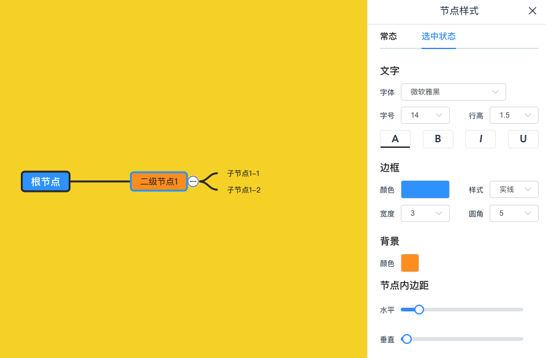

可以看到可以区分常态与选中态，这部分代码可以参考：[Style.vue](https://github.com/wanglin2/mind-map/blob/main/web/src/pages/Edit/components/Style.vue)。

除了节点样式编辑，对于非节点的样式也是同样的方式进行修改，先获取到当前的主题配置，然后进行回显，修改后通过相应的方法设置：

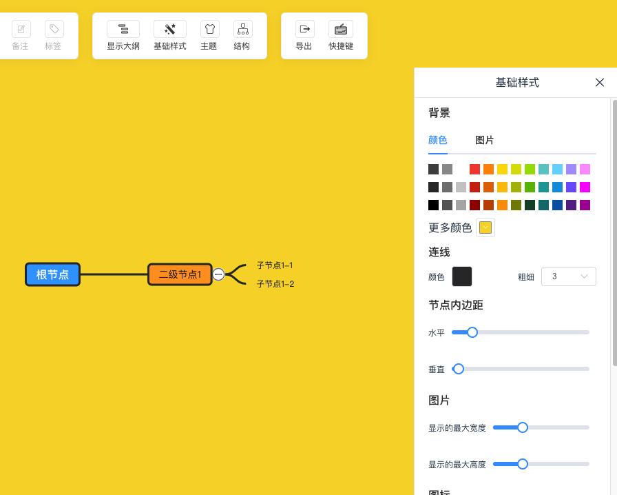

这部分的代码在[BaseStyle.vue](https://github.com/wanglin2/mind-map/blob/main/web/src/pages/Edit/components/BaseStyle.vue)。


# 多选节点

# 拖动、放大缩小

# 快捷键

快捷键就是监听了到特定的按键来执行特定的操作，包含单个按键和组合键，我们可以使用一个对象来保存快捷键和对应的命令，`key`代表按键，`value`代表要执行的命令，比如：

```js
const shortcutKeys = {
	'enter': 'addSiblingNode',
    'ctrl+b': 'bold'
}
```

包含两种类型，单个按键、以`+`拼接的组合键，接下来只要监听`keydown`事件来检查即可，首先要说明的是组合键一般指的是`ctrl`、`alt`、`shift`

# 导入导出、其他格式

https://github.com/canvg/canvg

https://github.com/fex-team/kityminder/tree/dev/src/protocol

https://github.com/fex-team/kityminder/tree/dev/native-support

json、freemind、xmind

png、svg

# 其他几种变种结构

逻辑结构图、鱼骨图、思维导图、组织结构图、目录组织图

