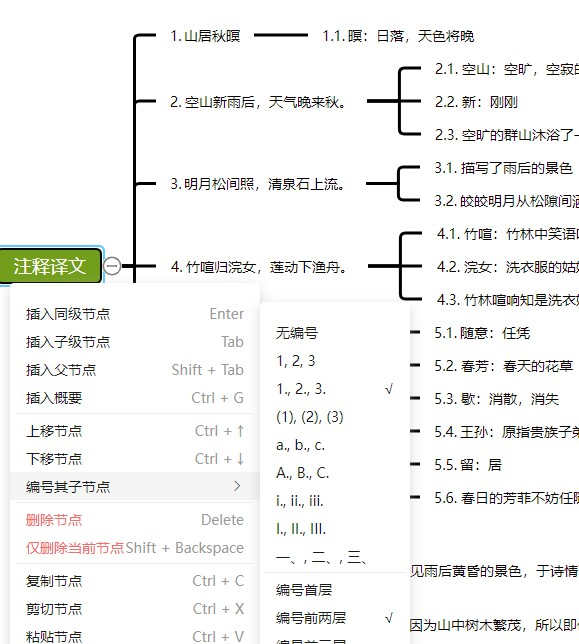

# Numbers chargeable plugin

The Numbers plugin provides the function of one click numbering of child nodes of a node, supports multiple numbering forms, and specifies the hierarchy of numbering:





You can experience it in the online version by right clicking on the node and clicking on its numbered child nodes.

## Charge

At present, the charging method is relatively primitive. By scanning the code and transferring money, please note the plugin you want to purchase and your email address(If you reach the maximum text limit, you can make the payment in two installments), and then the plugin file will be sent to your email. Purchase should be made after full use and consideration. If you are not familiar with front-end development and do not know how to use plugins, please consider purchasing carefully. There will be no refund unless there are special reasons. If you find bugs or have requirements, you can submit relevant issues.

Price: ￥ 29.9, including unpackaged source code and packaged files.


## Register

1.Referencing packaged files:

```js
import MindMap from 'simple-mind-map'
import Numbers from 'numbers.cjs.min.js'
// 或 import Numbers from 'numbers.esm.min.js'

MindMap.usePlugin(Numbers)
```

2.Referencing Unpackaged Source Code

You can first enter the plugin directory to execute:

```bash
npm link
```

Then enter your project root directory to execute:

```bash
npm link simple-mind-map-plugin-handdrawnlikestyle
```

Then you can directly import it for use:

```js
import MindMap from 'simple-mind-map'
import Numbers from 'simple-mind-map-plugin-numbers'

MindMap.usePlugin(Numbers)
```

After registration and instantiation of `MindMap`, the instance can be obtained through `mindMap.numbers`.

## Command

After registering this plugin, the 'SET_NUMBER' command will be added to the mind map instance to set node numbers. Use this command:

```js
mindMap.execCommand('SET_NUMBER', appointNodes, number)
```

This command can pass two parameters:

- `appointNodes`：Assign a number to a specified node instance, which can be passed as a single node instance or as an array of node instances. If an empty array is passed, a tag will be added to the currently activated node;

- `number`：If the number data to be set is passed as' null ', it means the number will be deleted. Otherwise, please pass an object with the following detailed fields:

| Field name | Type  | Default | Desc |
| ------- | ----- | ----- | ---- |
| type    | Number | 1    | Number format, default is '1', representing ordinary numbers, optional values: 1 (pure number), 2 (number with decimal point, such as: 1.), 3 (number with parentheses, such as: (1)), 4 (lowercase letter, such as: a.), 5 (uppercase letter, such as: A.), 6 (lowercase Roman number, such as: i.), 7 (uppercase Roman number, such as: I.), 8 (Chinese uppercase number, such as: 一、)     |
| level   | Number | 1    |  The child node hierarchy to be numbered, default is level 1, optional values: 1 (level 1), 2 (level 2), 3 (level 3), 0 (all levels)   |

When calling a command, you can pass only one field, such as '{type: 1}', and the other field will use the previous setting.

示例：

```js
mindMap.execCommand('SET_NUMBER', [], {
    type: 2,
    level: 3
})
```

After setting the number, the data will be saved to the node's 'data' under the name 'number'.